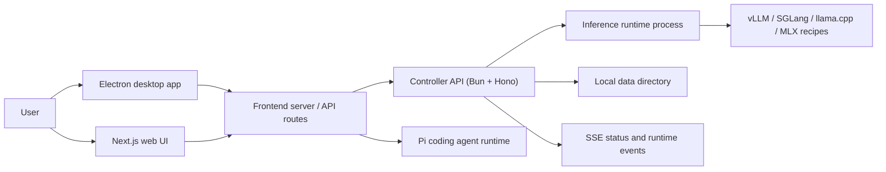
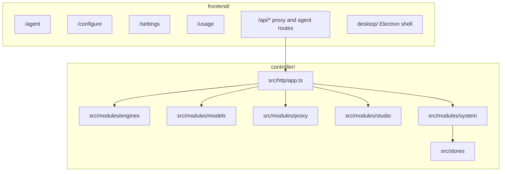

# Local Studio

Local Studio is a local-first workstation for running, managing, and using
self-hosted LLM backends. One machine can launch models, watch GPU/runtime
state, chat with OpenAI-compatible endpoints, and run agent sessions against
local or remote controllers. Version 2.0 unifies day-to-day operation around
Status, Workbench, Configure, and Usage instead of separate model, integration,
and server surfaces.

## Download

**[Download Local Studio for macOS (Apple Silicon)](https://github.com/sybil-solutions/local-studio/releases/latest/download/Local-Studio-arm64.dmg)**
— signed and notarized; updates itself from GitHub releases. All versions on the
[releases page](https://github.com/sybil-solutions/local-studio/releases), or via
[localstudio.ai](https://localstudio.ai).

It is built from two modules that share one controller API:

- [`controller/`](controller/README.md) — Bun/Hono backend. Owns model lifecycle
  (launch, evict, recipes, downloads, runtime process coordination), an
  OpenAI-compatible proxy (chat, models, tokenization, audio), system state
  (GPU metrics, logs, usage, settings, SSE), and controller integrations.
- [`frontend/`](frontend/README.md) — Next.js 16 + React 19 UI and the macOS
  Electron desktop shell. Hosts the Workbench (`/agent`), consolidated
  Configure surface, settings, usage, logs, and browser-facing API routes.

## Mobile companion

[KittyLitter](https://kittylitter.app) connects to Local Studio so the same
agent sessions, streaming content, reasoning, tool calls, and tool results are
available on iPhone, iPad, and Android. Pair from **Settings → Profile & phone →
Connect your phone**. The QR code and copied connection JSON are private
controller credentials; share them only with a device you trust.

See the complete pairing, version, and security guide at
[localstudio.ai/mobile](https://localstudio.ai/mobile). Mobile pairing requires
Local Studio 2.9.0 or newer and KittyLitter 1.6.0 or newer.

## What is a controller?

A controller is the backend process the UI talks to — the Bun/Hono
server in `controller/`. You can run one locally or point the frontend at a
remote controller on a GPU host. The controller owns model lifecycle, the
OpenAI-compatible proxy, system state, and SSE event streams.

## Architecture





## Quick start

Prerequisites: Bun 1.3.14+, Node.js 22.19+, npm 10+, Python 3.10+, and Git.
`uv` is strongly recommended; engine installs fall back to pip. vLLM/SGLang
serving on Linux needs NVIDIA driver + CUDA; Apple Silicon uses the MLX backend.

Validate the toolchain, then install every locked workspace dependency from the
repository root:

```bash
npm run doctor
npm run setup
```

Start the controller (listens on `127.0.0.1:8080`, data dir + SQLite created
automatically, model weights in `LOCAL_STUDIO_MODELS_DIR`, default `/models`):

```bash
bun --cwd controller run dev
```

Start the frontend in a second terminal, then open
<http://localhost:3000/setup>:

```bash
npm run dev
```

`npm run setup` installs the controller, shared contracts, agent runtime, and
frontend from their lockfiles. The setup wizard walks through choosing a models
directory, installing an engine, downloading a model, launching it, and
benchmarking. Engine installs (vLLM/SGLang/MLX) land below the data directory at
`runtime/venvs/<backend>-latest`.

## Agent runtime

The agent surface lives at `/agent` in the frontend. It uses
`@earendil-works/pi-coding-agent` through the frontend runtime rather than
shelling out to a separate agent process for normal turns. Agent skills and
extensions are discovered through Pi and surfaced in the session UI. Pi remains
the source of truth for authentication, settings, resources, tools, and native
JSONL sessions. The runtime respects `PI_CODING_AGENT_DIR`,
`PI_CODING_AGENT_SESSION_DIR`, and Pi's `sessionDir` setting in the same
precedence order as the CLI. Existing Local Studio session storage remains a
read-compatible legacy source, while new sessions use Pi's resolved directory.
Workbench sends only the active controller to Pi and shows that controller's
advertised models by default. The model picker has an explicit Other models
switch for models from the user's Pi catalog and providers connected in
Configure. Those opt-in models use Pi's native provider routing without adding
saved inactive controllers to the session.

New Workbench chats start with Pi's `read`, `grep`, `find`, and `ls` tools. Full
access enables every tool registered in that Pi session, including extension
tools. Read only is a model-tool allowlist, not an operating-system sandbox,
and loaded extensions may still have their own behavior. Pi runs with the full
permissions of the host user. Tailscale limits who can reach the dashboard; it
does not sandbox Pi.

## Runtime backends

Recipes launch through the controller runtime layer. Wired backend families:

- `vllm` — vLLM server recipes through configured/discovered/system/Docker/bundled targets.
- `sglang` — SGLang `launch-server` recipes through configured or discovered Python targets.
- `llamacpp` — llama.cpp `llama-server` recipes for GGUF models.
- `mlx` — MLX `mlx_lm.server` recipes for Apple Silicon.

Runtime target discovery, models, integrations, and server controls are
surfaced in Configure; selections persist in the controller data directory.

## Production

Build the frontend, then serve the controller and standalone frontend in separate
terminals:

```bash
npm run build
bun --cwd controller run start
npm run start
```

`npm run start` launches the standalone server through `scripts/project.mjs`.
Never use plain `next start` — it breaks SSE streaming. The controller runs the
same way in production as in development: `bun src/main.ts`.

Production web startup fails unless `LOCAL_STUDIO_FRONTEND_TOKEN` is set or
`LOCAL_STUDIO_FRONTEND_ALLOW_UNAUTHENTICATED=true` explicitly acknowledges
unauthenticated host access. Enter a configured token at `/access`; it is sent
only in a POST body and stored in an HttpOnly cookie. Frontend access grants the
permissions of the host user, including the agent's shell and filesystem tools.

The production frontend binds only to `127.0.0.1` and defaults to port `4783`.
`PORT` may be set to an integer from 1024 through 65535. Workspace paths are
canonicalized and must be under `WORKSPACE_ROOTS`, a platform-path-delimited
list that defaults to the current user's home directory. Add mounted locations
explicitly, for example `WORKSPACE_ROOTS="$HOME:/Volumes/Projects"` on macOS.

For private mobile access, first configure the exact Serve hostname:

```bash
cd frontend
ALLOWED_TAILSCALE_HOSTS=studio.example.ts.net npm start
tailscale serve --bg http://127.0.0.1:4783
tailscale serve status
```

Serve supplies a private HTTPS tailnet URL. Both devices must be in the intended
tailnet, and ACLs or grants should restrict the URL to its owner. Do not use
Tailscale Funnel. `tailscale serve --bg` persists the proxy configuration across
Tailscale restarts and reboots; it does not start Local Studio. Optionally set
`ALLOWED_TAILSCALE_USERS` to a comma-separated login allowlist. The
`Tailscale-User-Login` header is trusted only because the backend remains bound
to loopback behind Serve.

Manual availability requires `npm start` to remain active. An OS-native user
service can start the compiled app after login and restart it after a crash, but
it is intentionally not installed automatically. The host must still be on,
awake, online, and connected to Tailscale.

## Remote / LAN deployment

The controller binds `127.0.0.1` by default. Binding a non-loopback host (e.g.
`LOCAL_STUDIO_HOST=0.0.0.0`) requires `LOCAL_STUDIO_API_KEY` — startup throws
without it. On a trusted LAN you may instead set
`LOCAL_STUDIO_ALLOW_UNAUTHENTICATED=true` to opt out of authentication.

Point the frontend at a remote controller with `BACKEND_URL` or
`NEXT_PUBLIC_API_URL` (default `http://localhost:8080`).

Deploy with your normal SSH or infrastructure workflow. The repository does not
maintain a second deployment wrapper alongside the controller installer.

The controller installer registers a persistent user service automatically
(`launchd` on macOS and `systemd --user` on Linux), so installed controllers
return after login without a repository daemon wrapper.

## Commands

Five commands cover the whole repo; everything else is plumbing they call.

```bash
npm run setup           # toolchain check + install every workspace
npm run dev             # frontend dev server + agent runtime, watch mode
npm run check           # every gate CI runs, in one command
npm run build           # production Next build + standalone repair + assertions
npm run desktop:dist    # build and package the macOS app
```

All automation lives in `frontend/desktop/automation/*.mjs` — plain readable
modules dispatched by `scripts/project.mjs` (`node scripts/project.mjs` with no
arguments lists every subcommand). The pre-push hook checks conventional
commits and runs the frontend quality gate before pushing; the hook filenames
in `.githooks/` are symlinks to `scripts/project.mjs` and contain no logic of
their own.

## Releases

Every successful `main` CI run builds an unsigned macOS app and keeps the
exact-SHA package as a GitHub Actions artifact. Conventional commits
then trigger `release.yml`. Semantic Release chooses the next version (`feat` →
minor, breaking → major, all other allowed commit types → patch).

The release workflow builds the exact revision without Apple credentials,
then passes only that unsigned app bundle to a separate signing job. The signing
job installs the lockfile-pinned signing tooling without lifecycle scripts,
signs, notarizes and staples the release assets, and hands them to a final
publish job. Each stage rechecks that its revision is still `origin/main`; only
the final stage can create the GitHub release with the DMG, updater files,
stable website alias, checksums, and source manifest. There is no npm publish
and tags are never created by hand.

## Acknowledgements

Local Studio is built with and inspired by exceptional open-source work:

- [Pi](https://github.com/earendil-works/pi) — the agent runtime and native
  session model behind Workbench.
- [T3 Code](https://github.com/pingdotgg/t3code) — inspiration for a focused,
  developer-first coding workbench.
- [SGLang](https://github.com/sgl-project/sglang) — a high-performance model
  serving backend supported by Local Studio recipes.
- [vLLM](https://github.com/vllm-project/vllm) — a high-throughput inference
  and serving backend supported throughout Local Studio.
- [Convex](https://github.com/get-convex/convex-backend) — inspiration for
  reactive, real-time application architecture.

## Contributing

Contributions should be small, focused, and easy to review. Start from the
latest `dev`, one logical change per branch, no formatting-only rewrites, no
secrets or build artifacts. Run `npm run check` before opening a PR; include a concise summary, the validation
commands you ran, and screenshots for UI changes. See AGENTS.md for the full
code standards an agent (or contributor) must follow.

## License

See [LICENSE](LICENSE).
