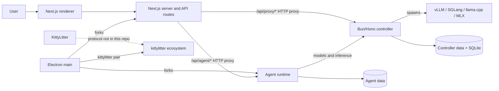
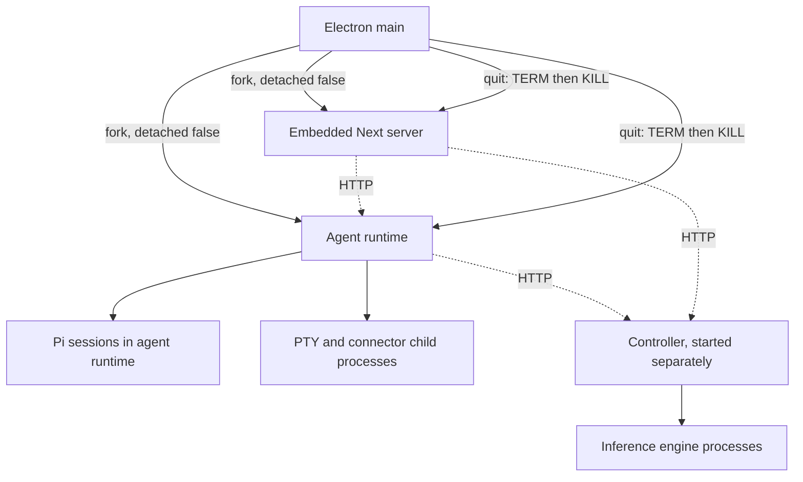

# Local Studio architecture

This guide describes commit `6c26b3a` as inspected on 2026-09-02. It is an
evidence-based map, not a description of the architecture proposed in issue
[#3](https://github.com/urucoder/local-studio/issues/3). Where the issue and
the checkout differ, this guide says so explicitly.

## The short version

Local Studio is a local-first workstation with three main layers:

1. **Controller** — a Bun/Hono HTTP server that launches inference engines,
   inventories models and hardware, records usage, and presents
   OpenAI-compatible APIs (`controller/src/http/app.ts`, `createApp`).
2. **Agent runtime** — a Node/Hono service that hosts Pi coding-agent sessions,
   tools, projects, connectors, OAuth, skills, goals, and automations
   (`services/agent-runtime/src/http/app.ts`, `createAgentRuntimeApp`).
3. **Frontend and desktop** — a Next.js application and an Electron shell.
   Next presents the UI and proxies requests; Electron starts the local
   services and supplies OS-only capabilities (`frontend/src/app`,
   `frontend/desktop/main.ts`, `run`).

An **inference runtime** (vLLM, SGLang, llama.cpp, or MLX) is different from
the **agent runtime**. The controller supervises the former; Electron currently
supervises the latter.

## A critical finding about KittyLitter

The checked-out source contains **no Litter bridge gateway**, no
`/api/litter-bridge/v1` route, no `litter-bridge.json`, and no
`litter-controller-id`. Repository-wide searches find only the pairing UI and
the external executable integration. Pairing executes `kittylitter pair` and
validates its JSON output (`frontend/desktop/logic/kittylitter-pairing.ts`,
`getKittylitterPairingJson` and `normalizeKittylitterPairingJson`). The UI
reaches that helper over Electron IPC or a local Next route
(`frontend/src/features/settings/profile-settings.tsx`,
`loadPairing`; `frontend/src/app/api/kittylitter/pairing/route.ts`, `POST`).

Consequently, the phone transport, gateway endpoints, gateway secret,
controller calls, metadata-file lifecycle, and use of `relay` cannot be
established from this repository. They are open questions, not facts. This
corrects a central premise of issue #3 and is the first dependency of any
refactor.

## Processes and lifetime

Packaged startup is:

1. `frontend/desktop/main.ts` `run` obtains the single-instance lock,
   registers lifecycle and IPC handlers, then waits for Electron.
2. `bootstrap` calls `startFrontendServer`.
3. `frontend/desktop/logic/app-server.ts` `startFrontendServer` selects a
   stable loopback port, starts/reuses the agent runtime, then forks Next's
   standalone `server.js`.
4. `frontend/desktop/logic/agent-runtime-server.ts` `startAgentRuntime` forks
   packaged `agent-runtime/standalone.mjs`, injects data/resource/frontend
   paths, and polls `/health`.
5. Electron loads the Next URL in a hardened `BrowserWindow`
   (`frontend/desktop/logic/window-manager.ts`, `createMainWindow`).
6. On quit, `shutdown` stops health monitoring and PTYs. `stopFrontendServer`
   and `stopAgentRuntime` send `SIGTERM`, then `SIGKILL` after five seconds.

Development is different: `frontend/package.json` `dev` runs Next and
`bun --watch src/server.ts` side by side. Production web startup uses
`frontend/desktop/automation/start.mjs`; the controller is always a separately
started Bun process (`controller/src/main.ts`).

## Request paths

The renderer normally talks only to same-origin Next APIs:

- **Agent path:** `/api/agent/*` routes authenticate at Next and call
  `proxyToAgentRuntime`, which preserves path/query and streams the response to
  `LOCAL_STUDIO_AGENT_RUNTIME_URL`
  (`frontend/src/app/api/agent/proxy-to-runtime.ts`).
- **Controller path:** `/api/proxy/[...path]` resolves a controller and API key
  then forwards the request (`frontend/src/app/api/proxy/[...path]/route.ts`,
  `handleRequest`; `proxy-target.ts`, `resolveProxyTarget`).
- **Remaining in-process state:** `/api/settings`, `/api/local-agents`, and
  controller proxy target resolution import runtime settings code directly
  (`frontend/src/app/api/settings/route.ts`;
  `frontend/src/app/api/local-agents/route.ts`;
  `frontend/src/app/api/proxy/[...path]/proxy-target.ts`).
- **OS path:** preload exposes a narrow `DesktopBridge`; calls such as project
  selection, native PTY, updates, file reveal, pairing, and controller deploy
  cross Electron IPC (`frontend/desktop/preload.ts`; `interfaces.ts`,
  `DesktopBridge`; `main.ts`, `registerIpcHandlers`).

Issue #3's statement that connectors, plugins, projects, and skills are still
in-process is stale: their Next routes now use `proxyToAgentRuntime`, and the
runtime registers corresponding HTTP handlers
(`services/agent-runtime/src/http/app.ts:161-191`).

## Layer tour

### Controller

Hono assembles system, compute, engine, model, studio, and proxy route groups,
then applies request authority, CORS, observability, rate limiting, and API-key
middleware (`controller/src/http/app.ts`, `createApp`). It exposes `/health`,
`/status`, `/gpus`, metrics/logs/events/usage and studio configuration, plus
model lifecycle and OpenAI/Anthropic-compatible proxy routes. OpenAPI is
generated at `/api/spec` and rendered at `/api/docs`.

Configuration is decoded once by Effect Schema
(`controller/src/config/env.ts`, `createConfig`). State lives beneath its own
data directory, including `controller.db`; inference processes are supervised
by `controller/src/modules/compute`, not by Electron.

### Agent runtime

`services/agent-runtime/src/server.ts` starts the automation scheduler and
session watcher, then serves Hono on hard-coded `127.0.0.1` and `PORT` (default
8081). `createAgentRuntimeApp` rejects non-loopback `Host` headers before
registering health and `/api/agent/*` routes. This is DNS-rebinding protection,
not client authentication.

`services/agent-runtime/src/pi-runtime.ts` wraps
`@earendil-works/pi-coding-agent`. `pi-runtime-models.ts` `mergeControllers`
combines the saved primary controller with per-request controllers,
deduplicates normalized URLs, fetches `/v1/models`, and writes Pi provider
configuration under `pi-agent/`. Sessions are native Pi JSONL files resolved by
`sessions-store.ts`; metadata and rollout summaries are sidecars.

The runtime also owns:

- MCP connector configuration, process pooling, secret masking, and per-model
  grants (`connectors-service.ts`, `connector-pool.ts`, `connector-grants.ts`);
- built-in/user plugins, skills, and prompt templates (`builtin-plugins.ts`,
  `user-plugins.ts`, `skill-discovery.ts`, `prompt-templates-store.ts`);
- goals, scheduled automations, and subagents (`goal-driver.ts`,
  `automation-scheduler.ts`, `subagents.ts`);
- a Playwright browser host and web PTYs (`browser-host/browser-host.ts`,
  `pty-service.ts`);
- generic OAuth connectors and Google Workspace account flows
  (`oauth-connectors.ts`, `google-account.ts`,
  `google-oauth-loopback.ts`).

The bundle is built by the `bundle-agent-runtime` automation invoked from
`services/agent-runtime/package.json`; Electron packages
`dist/standalone.mjs` and its native/runtime dependencies
(`frontend/desktop/electron-builder.yml`, `extraResources`).

### Next.js frontend

The App Router is in `frontend/src/app`. Routes without `"use client"` are
server components by default and generally compose interactive feature
components. Explicit client pages include settings, setup, logs, and the quick
panel. `app/layout.tsx` installs same-origin CSRF headers and optional service
worker support; `app/providers.tsx` hosts client providers.

The principal pages are `/`, `/agent`, `/configure`, `/models`, `/settings`,
`/setup`, `/usage`, `/logs`, `/integrations`, `/discover`, `/recipes`,
`/server`, `/quick`, and `/access`. Feature implementation is grouped under
`frontend/src/features`; reusable design-system code is under
`frontend/src/ui`.

### Electron desktop

Electron's **main process** can use Node and OS APIs; the **renderer** is the
isolated web page. `preload.ts` is the deliberately small bridge between them.
Window creation disables Node integration and enables context isolation
(`window-manager.ts`); `security.ts` constrains navigation, window creation,
and permissions.

`main.ts` owns main/quick-panel windows, server recovery, auto-update,
controller deployment, native projects, preferences, pairing, and PTY IPC.
Packaging uses electron-builder for arm64 macOS DMG/ZIP, Windows NSIS, and
Linux AppImage (`frontend/desktop/electron-builder.yml`).

## Detailed maps

- [Component and route inventory](components.md)
- [Configuration and environment](configuration.md)
- [State and ownership](state-data.md)
- [Network and trust boundaries](network-trust.md)
- [End-to-end walkthroughs](sequences.md)
- [Coupling analysis](coupling-analysis.md)
- [Refactor options and recommendation](refactor-options.md)
- [Glossary](glossary.md)

## Where to look when something breaks

| Symptom                               | First evidence to inspect                                                                                      |
| ------------------------------------- | -------------------------------------------------------------------------------------------------------------- |
| Desktop never opens                   | Electron logs; `main.ts` `bootstrap`; `app-server.ts` health polling                                           |
| “agent runtime unreachable”           | `LOCAL_STUDIO_AGENT_RUNTIME_URL`; runtime `/health`; `proxy-to-runtime.ts`                                     |
| Models absent                         | `api-settings.json`; `pi-runtime-models.ts` controller probe; controller `/v1/models`                          |
| Controller rejected request           | `controller/src/http/security-middleware.ts`, API key, host and CORS config                                    |
| Session/turn failure                  | `http/handlers.ts`, `pi-runtime.ts`, Pi session JSONL and runtime stderr                                       |
| Connector cannot start                | `connectors-service.ts`, `connector-pool.ts`, grants, executable `PATH`                                        |
| OAuth says secure storage unavailable | runtime `oauth-vault.ts` and Electron `logic/oauth-vault.ts`; standalone has no vault parent                   |
| Browser cannot reach a private host   | `browser-host/network-policy.ts` and `LOCAL_STUDIO_BROWSER_ALLOW_PRIVATE`                                      |
| Pairing reports `ENOENT`              | `KITTYLITTER_BIN` and `kittylitter-pairing.ts`; no gateway implementation exists here                          |
| Phone cannot connect                  | inspect the external KittyLitter/controller gateway implementation; this repo cannot answer the transport path |
| Packaged build misses a module        | `electron-builder.yml`, runtime bundle automation, `next.config.ts` tracing                                    |

## Open questions

1. Where is the source or protocol specification for the gateway and
   `kittylitter` binary?
2. What does the phone contact after scanning, and how are tokens issued,
   rotated, revoked, and scoped?
3. Must remote agent sessions operate on remote files, or keep desktop-local
   filesystem/browser/terminal semantics?
4. Is the target single-user, or must the design isolate multiple users?
5. Which public ingress, TLS, identity, and secret-store mechanisms are
   acceptable?
