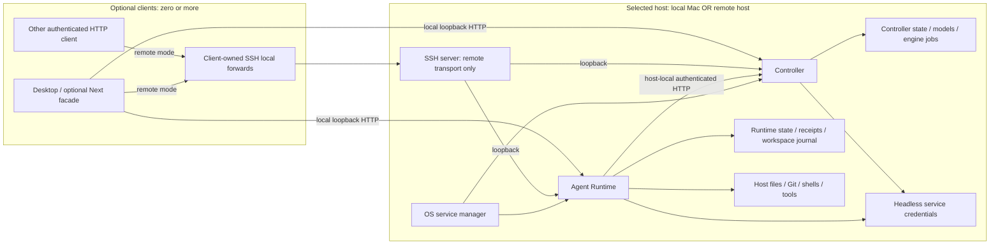
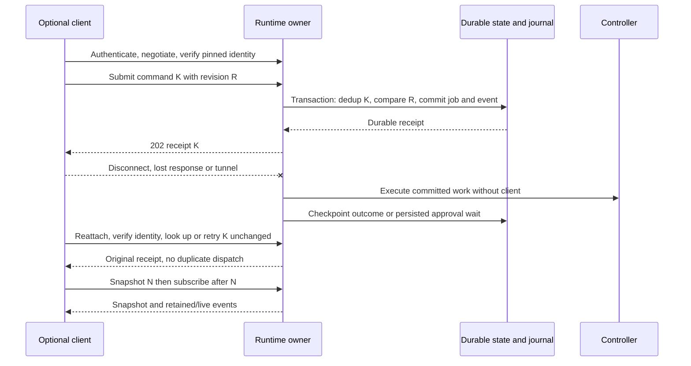
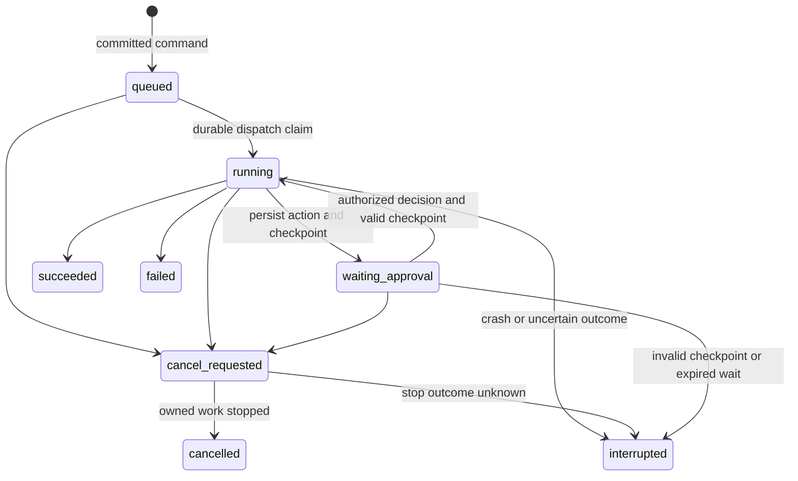

# ADR-0012: Autonomous core ownership and attachment contracts

Date: 2026-09-08. Scope: [#12](https://github.com/urucoder/local-studio/issues/12),
under [#10](https://github.com/urucoder/local-studio/issues/10) and
[#3](https://github.com/urucoder/local-studio/issues/3).

**Status: confirmed architectural direction; proposed protocol and operational decisions
await owner approval.** Committing the schemas does not approve these proposals or
make the APIs available. This ADR replaces the lifecycle recommendation in
[PR #8](https://github.com/urucoder/local-studio/pull/8), not its historical evidence.
The PR documents were absent from this branch; they were inspected through the PR.

## 1. Context and verified implementation

Source baseline: `0978c4a7329da9e70adb179aca14eb5e91411d2d`. The following are
observations about existing code, not autonomy or deployment acceptance:

| Evidence                                                                                                                                                                                                                                                                                                                                                                 | Current behavior and implication                                                                                                                                              |
| ------------------------------------------------------------------------------------------------------------------------------------------------------------------------------------------------------------------------------------------------------------------------------------------------------------------------------------------------------------------------ | ----------------------------------------------------------------------------------------------------------------------------------------------------------------------------- |
| [Desktop runtime launcher](../../frontend/desktop/logic/agent-runtime-server.ts#L63-L165), [app shutdown](../../frontend/desktop/logic/app-server.ts#L333)                                                                                                                                                                                                               | Electron forks/configures the runtime and can stop it with the app. Both local and remote target lifecycles supersede this ownership.                                         |
| [Runtime server](../../services/agent-runtime/src/server.ts#L6-L23), [systemd template](../../services/agent-runtime/systemd/local-studio-agent-runtime.service)                                                                                                                                                                                                         | Standalone entry point and scheduler exist. Loopback binding and immediate signal exit do not establish durable draining or full installation/reboot guarantees.              |
| [Runtime route registry](../../services/agent-runtime/src/http/app.ts#L166-L197) and frontend [connectors](../../frontend/src/app/api/agent/connectors/route.ts#L11), [plugins](../../frontend/src/app/api/agent/plugins/route.ts#L11), [projects](../../frontend/src/app/api/agent/projects/route.ts#L8), [skills](../../frontend/src/app/api/agent/skills/route.ts#L8) | These surfaces already have HTTP handlers/proxies. Do not redo those migrations. Audit remaining bypasses and host-side authorization instead.                                |
| [Project client](../../frontend/src/features/agent/projects/api.ts#L23-L65), [shell route](../../frontend/src/app/api/agent/terminal/route.ts#L1-L51)                                                                                                                                                                                                                    | Desktop project IPC still wins; the non-PTY shell route executes in Next. Existing HTTP coverage is not proof of consistent host ownership.                                   |
| [Controller configuration](../../services/agent-runtime/src/pi-runtime-models.ts#L219-L287)                                                                                                                                                                                                                                                                              | Runtime merges and persists controller settings. A forwarded client URL must not overwrite these server-side settings.                                                        |
| [Project store](../../services/agent-runtime/src/projects-store.ts#L23-L38)                                                                                                                                                                                                                                                                                              | Projects use `LOCAL_STUDIO_PROJECTS_FILE` or ancestor `data/agentfs/projects.json` discovery, independently of `LOCAL_STUDIO_DATA_DIR`.                                       |
| [Prompt submission](../../services/agent-runtime/src/http/handlers.ts#L191-L245), [automation execution](../../services/agent-runtime/src/automation-scheduler.ts#L150-L204)                                                                                                                                                                                             | Prompt acceptance already launches work separately, and schedules already execute without a stream consumer. Neither supplies the proposed durable receipt/recovery protocol. |
| [PTY service](../../services/agent-runtime/src/pty-service.ts#L49-L69), [subscription](../../services/agent-runtime/src/pty-service.ts#L232)                                                                                                                                                                                                                             | Shells outlive stream attachment and replay bounded output, but sessions and replay are in memory, not restart-durable. Existing exit cleanup removes sessions.               |
| [Connector extension](../../frontend/desktop/resources/pi-extensions/connectors.ts#L19), [CUA](../../frontend/desktop/resources/pi-extensions/cua.ts#L38), [subagents](../../frontend/desktop/resources/pi-extensions/subagents.ts#L21), [automations](../../frontend/desktop/resources/pi-extensions/automations.ts#L22)                                                | Required tool paths still use `LOCAL_STUDIO_FRONTEND_BASE`. Replace this dependency; an SSE subscription is not the same thing as a required callback server.                 |
| [OAuth vault](../../services/agent-runtime/src/oauth-vault.ts#L59-L109), [connector OAuth](../../services/agent-runtime/src/oauth-connectors.ts#L348-L433)                                                                                                                                                                                                               | The vault requires Electron-parent IPC. Device/PKCE flow machinery exists; that does not certify every provider for headless operation or migrate every secret store.         |
| [Runtime route registry](../../services/agent-runtime/src/http/app.ts#L125)                                                                                                                                                                                                                                                                                              | No KittyLitter gateway is established by this registry. Mobile protocol discovery, pairing, and independent ingress remain separate parent work.                              |

## 2. Confirmed decisions

- Agent Runtime and controller form one autonomous core while remaining **separate
  services**, independently supervised and with distinct authoritative data roots.
- **Both local and remote cores outlive all frontend processes and connections.**
  Supported background work runs with zero frontends. Closing a window, quitting
  Electron, or losing an HTTP stream/tunnel is not service shutdown or cancellation.
- Frontends are optional attachable HTTP clients, not mandatory in-process plugins.
  A local Next facade may serve a client; no core operation requires it.
- Local attachment uses loopback HTTP. SSH is the default remote transport.
  Contracts are transport-independent; Tailscale implementation is deferred.
- Projects, files, Git, terminals, connectors, and agent tools operate on the
  selected runtime host. No automatic local/remote synchronization, Mac worker,
  matching-path substitution, silent local fallback, or mandatory reverse tunnel.
- A sleeping/offline local host cannot perform continuous work. Frontend detach
  guarantees do not imply crash, shutdown, reboot, or arbitrary-process recovery.

## 3. Target topology

Local and remote arrows are alternative attachments to the selected core, not
simultaneous execution targets. Core startup, scheduling, approval persistence,
and model serving have no dependency arrow to Clients. Service-management
operations are explicit privileged actions, never part of attach/detach.
See [SSH attachment details](ssh-tunnel-modes.md).

## 4. Proposed decisions requiring owner review

All details below, including the v1 protocol, are **proposed**, not approved.

| Decision              | Recommendation                                                                                                                                                                                 | Trade-offs / alternative                                                                                                                                                                                                                                                                                |
| --------------------- | ---------------------------------------------------------------------------------------------------------------------------------------------------------------------------------------------- | ------------------------------------------------------------------------------------------------------------------------------------------------------------------------------------------------------------------------------------------------------------------------------------------------------- |
| First remote platform | Linux x86-64, Ubuntu 24.04 LTS, systemd system units running as a dedicated non-root account; separate runtime/controller units                                                                | Straightforward boot/logout independence; excludes initial Windows/remote macOS and container orchestration. A user unit requires explicit lingering.                                                                                                                                                   |
| Local supervisor      | macOS launchd user services, independent of Electron                                                                                                                                           | Survives app exit; user logout/pre-login execution is not guaranteed. A system daemon with a dedicated identity would change permissions and Keychain access.                                                                                                                                           |
| User/isolation model  | One trusted owner per core, multiple authenticated clients, one writer service per data root; workspace allowlists                                                                             | Not a multi-tenant sandbox. Tools share OS privileges; unrelated/untrusted users need separate OS accounts/cores or hosts. Containers are future isolation work, not implied by SSH.                                                                                                                    |
| Secret backend        | Service-owned encrypted vault; macOS Keychain-backed key access and Linux supervisor-provisioned key via systemd encrypted credentials, preferably TPM-backed                                  | No Electron IPC or renderer-held service secrets. Locked/unavailable keys block dependent capabilities. Unattended software-key fallback requires explicit risk acceptance and secure provisioning; never store the key beside ciphertext. Rotation, backup, and provider-specific stores need #19/#17. |
| OAuth                 | Provider-supported device authorization first; same-host loopback PKCE locally; remote loopback flows unavailable until an explicit provider-compatible callback transport is approved         | Device flow avoids callbacks but is not universal. A short-lived authorization ceremony can need a human/browser; refresh and already-authorized work must not need the frontend. No universal callback broker or mandatory reverse tunnel.                                                             |
| PTY lifetime          | Runtime owns PTYs, survives detach within one process lifetime; 1 MiB output ring, 24-hour idle expiry, explicit close, one renewable 30-second writer lease                                   | Bounded memory and orphan cleanup; not restart persistence. Output replay can truncate. Multiplexer-backed recovery is deferred.                                                                                                                                                                        |
| Concurrent clients    | Optimistic revisions, transactional compare-and-swap, one executing job per session; multiple observers; explicit PTY writer lease                                                             | Avoids silent last-writer-wins and duplicate turns. Conflicts require refresh/user intent; no offline merge or distributed active-active writer.                                                                                                                                                        |
| Recovery              | Persist accepted commands and state before acknowledgement; recover queued jobs and valid approval waits; mark uncertain running work interrupted, never automatically rerun arbitrary effects | Conservative and auditable; loses seamless running-process recovery. Requires durable transactions, reconciliation and operator-visible repair, not only process restart.                                                                                                                               |
| Retention             | Workspace events: 7 days or 64 MiB, whichever first; command receipts: at least 7 days and through command expiry; resources until explicit authorized deletion                                | Replay is bounded, snapshots remain authoritative. Quotas/backpressure must reject new work before violating promised durable receipt retention.                                                                                                                                                        |
| Schedule downtime     | UTC interval/one-shot coordination contract; skip missed occurrences and record the skip, then resume future intervals                                                                         | Prevents a reboot catch-up burst. Existing daily/weekly schedules retain their existing contract pending explicit #17 mapping; no lossy automatic conversion.                                                                                                                                           |

## 5. Proposed v1 API and state contract

The single definition is
[`shared/agent/autonomous-core-v1.ts`](../../shared/agent/autonomous-core-v1.ts).
It uses Effect Schema and Effect decoders; it adds **no production routes** and
does not replace existing `/api/agent/*` or controller APIs. Protocol versions are
independent of desktop release/package versions and persisted database versions.

### Identity, resolution, readiness, and connection

- `CoreIdentityV1Schema`: four stable opaque, canonical lowercase UUIDs: `coreId` (installation),
  `hostId` (enrolled execution host, not DNS name), `runtimeId`, `controllerId`.
  Allocate and persist them during provisioning, before serving requests. Renaming
  a host, changing ports, credential rotation, and normal restart do not change them.
  Per-service `instanceId` changes on process restart; it is null when no instance
  is known. A cloned/restored core on another host must be re-enrolled, not run
  concurrently with copied identities. Restore invalidates journal epochs.
- A profile pins the full identity after explicit authenticated enrollment. SSH
  host-key verification and application identity checks are both required.
  A process answering on the expected port is not enough. A mismatch blocks
  attachment/mutation; never silently update the pin or substitute a local core.
- `WorkspaceV1Schema` identifies a workspace by **core identity + workspaceId**,
  with a revision and host-local absolute root. Paths are display/host resolution
  data, not client authorization. Only the runtime resolves canonical roots and
  validates each relative operation, symlinks, grants, and resource relationships.
  A valid schema is not an authorization check.
- `ControllerResolutionV1Schema` is an administrative, runtime-owned view of
  versioned service settings and credential availability. `serverEndpoint` is
  resolved on the runtime host. Runtime verifies the paired controller's identity
  before inference. Client forwarding endpoints live only in `CoreConnectionV1Schema`,
  never in server settings; renderer payloads never contain controller credentials.
- `CoreReadinessV1Schema` separates process liveness from operational readiness.
  `ready` requires usable storage, completed compatible migrations, required keys
  and verified controller linkage. Commands are conservatively admitted only when
  both services are ready and `acceptsCommands` is true; draining/blocked cores still
  permit authorized inspection. Degraded capabilities explain unavailable functions.
  A controller outage does not imply the runtime process or local file APIs died.
- `CoreConnectionV1Schema` is **client-local state**, not core job ownership.
  State progresses detached → connecting → authenticating → checking-identity →
  attached; transport loss becomes reconnecting, invalid auth/identity/version
  becomes blocked. Cached observations must be visibly stale, never proof of
  current readiness. No connection-state update cancels or starts service work.

### Endpoint proposal

All data routes require application authentication and workspace/resource
authorization, even on loopback or through SSH. Anonymous liveness reveals no
identity, paths, credentials, or user activity. A deployment's Host/origin/CSRF
policy belongs to #14; SSH authentication alone is not HTTP authorization.

| Proposed endpoint                                                            | Boundary / behavior                                                                                                                           |
| ---------------------------------------------------------------------------- | --------------------------------------------------------------------------------------------------------------------------------------------- |
| `GET /health` on each service                                                | Minimal process liveness only; existing runtime shape is not a readiness promise                                                              |
| `GET /.well-known/local-studio-core` on each service                         | Authenticated `CoreProtocolAdvertisementSchema`: stable identity and nonempty unique supported protocol versions; immutable negotiation shape |
| `GET /api/core/v1/discovery` on runtime                                      | `CoreDiscoveryV1Schema`: v1 payload, proposal marker, versions, capability availability and enforced retention limits                         |
| `GET /api/core/v1/readiness` on runtime                                      | `CoreReadinessV1Schema`, including paired controller observation; 503 when not accepting commands                                             |
| `GET /api/core/v1/controller-resolution` on runtime                          | Administrative `ControllerResolutionV1Schema`; never raw credential values                                                                    |
| `GET /api/core/v1/workspaces/:workspaceId` on runtime                        | `WorkspaceV1Schema`; scoped host identity, never client filesystem inspection                                                                 |
| `POST /api/core/v1/commands` on runtime                                      | `CoreCommandV1Schema` → durable `CoreCommandReceiptV1Schema`; 202 first acceptance, 200 same-command receipt                                  |
| `GET /api/core/v1/commands/:commandId` on runtime                            | Authorized receipt lookup after an uncertain response; 404 is not proof a command never ran after retention/restore                           |
| `GET /api/core/v1/workspaces/:workspaceId/activity` on runtime               | Atomic `ActivitySnapshotV1Schema` at a journal cursor                                                                                         |
| `GET /api/core/v1/workspaces/:workspaceId/events?epoch=…&after=…` on runtime | SSE `ActivityEventV1Schema` records after cursor; parse path/query and authenticated identity into `ActivityReplayRequestV1Schema`            |

Choose the highest mutually supported version from the advertisement before decoding
versioned data. No intersection means blocked/version-mismatch, not best-effort
parsing or downgrade to legacy handlers. V1 rejects unknown fields/discriminants;
evolution requiring new fields needs a new negotiated version, not a minor package
bump. The proposal marker must be revised through owner review before stabilization.
Older stored-state formats require an explicit migration, backup, and compatible
reader; do not reinterpret incompatible data or auto-downgrade it on startup.

Use `coreBoundaryV1(expectedIdentity)` for strict Effect decoding and identity
matching of commands, discovery, workspaces, receipts, snapshots, and events.
It rejects malformed UUIDs, non-v1 envelopes, extra properties, invalid command
variants, noncanonical UTC timestamps, and cross-workspace activity resources.
Transport code must additionally compare path/query workspace IDs, check identity
against its provisioned configuration, enforce byte/count limits before decoding,
and perform authorization and transactional state validation before effects.

`CoreErrorV1Schema` is the authenticated v1 error envelope, with redacted messages.
Use 400 invalid-payload; 401 unauthenticated; 403 forbidden; 404 not-found;
409 identity/version/revision/idempotency/writer-lease conflict; 410 expired
command/approval/cursor; 422 unsupported-capability; 503 not-ready.
Before negotiation/authentication, use HTTP status without identity-bearing detail
(unsupported version: 406 and the authenticated advertisement). Clients never
trust an error body to replace a pinned identity. A malformed versioned payload
is a protocol error, not a transient connection failure.

### Commands, deduplication, and concurrent mutation

- Commands contain identity/version, UUID `commandId`, canonical UTC `issuedAt`
  and `expiresAt`, and a discriminated `body`. Proposed acceptance window: at most
  24 hours from issue, five-minute future-clock tolerance. Validate with server
  time; reject expired unknown commands. These temporal rules require a clock and
  belong to handlers, not the structural schema.
- Supported coordination commands: `job.submit`, `job.cancel`, `schedule.put`,
  `schedule.delete`, `approval.resolve`, `terminal.open`, `terminal.close`,
  `terminal.claim`, `terminal.input`. They are not arbitrary method/path forwarding.
  Rich turn inputs, session creation, file/Git mutations and terminal resize/output
  use their domain contracts in sibling work; v1 does not silently reinterpret
  existing turn/session identifiers or daily/weekly schedules.
- Every command carries `workspaceId` and `expectedRevision`. For `job.submit`
  compare the existing session revision and create the job; for other commands
  compare the addressed schedule/job/approval/terminal revision. Zero means
  create-if-absent only (`schedule.put`, `terminal.open`); other targets must exist.
  Validate referenced session/job belongs to that workspace. `schedule.delete`
  produces a revisioned tombstone; an accepted receipt is not proof of completion.
- Dedup key: authenticated principal + coreId + commandId, independent of HTTP
  connection/client instance. Atomically store the canonical decoded command digest,
  receipt, state transition and journal entry before acknowledgement; dispatch
  queued work only from committed state. Concurrent first submissions serialize.
  Same key and payload returns the original resource/revision, with `deduplicated`
  true; different payload returns idempotency-conflict even after state changes.
  Look up a retained receipt before current expiry/revision checks, but recheck
  current authorization before revealing it.
- Keep the receipt/digest through at least max(7 days after commit, command expiry).
  After pruning, old commands are expired, never silently fresh submissions.
  On timeout, retry only the identical command/key within this guarantee or inspect
  the receipt/activity; never mint a fresh ID as an automatic transport retry.
  External tools, inference calls, PTY input, and Git/network effects are **not
  exactly-once**. A crash between an effect and its checkpoint can leave uncertainty.
  Retried receipts do not replay those effects; operator reconciliation is required.
- Compare-and-swap and dedup checks run in the same owner transaction. No silent
  last-writer-wins. A job creation advances the session revision and occupies its
  execution slot; conflicting submissions get revision-conflict, not an implicit
  steer or parallel turn. Explicit scheduling policy decides later queued work.
- `terminal.claim` grants/renews a lease only to its authenticated holder, or claims
  an expired lease; another live holder gets writer-lease-conflict. `terminal.input`
  requires its lease ID, holder identity, unexpired server-side lease, and matching
  terminal revision. Lease renewal is independent of HTTP stream lifetime.
- Approval resolution binds the exact persisted `actionDigest`, approval revision,
  expiry, job and workspace. Only a valid pending wait can transition once.
  Human absence leaves it pending; expiry fails closed. Cancellation invalidates
  pending approvals; race resolution is transactional, never a late tool grant.

### Activity and replay

Snapshots contain typed job/session/schedule/terminal/approval summaries, not
secrets or full tool output. Events are typed resource upserts or revisioned
tombstones. The workspace journal has a durable random `epoch` and strictly
increasing safe-integer `sequence`. Snapshot at N is a consistent view of all
authorized resources in that workspace; replay starts at N+1 without a gap.
Persist journal and resource changes together. Normal service restart preserves
the epoch; restore/reset changes it. Rotate the epoch before sequence overflow.

Use SSE id `epoch:sequence`. Heartbeats carry no state and consume no sequence.
Delivery is at-least-once; clients ignore already applied cursors/revisions.
On a gap, backwards revision, mismatched identity/workspace, unknown event shape,
expired cursor, or changed epoch, stop applying deltas and fetch a fresh snapshot.
Do not mix epochs or infer missing transitions. A too-old or ahead-of-server cursor
gets 410 cursor-expired before streaming. Stream-time reset closes the stream and
requires a new snapshot. Slow clients are disconnected rather than pinning retention.
Capability or authorization changes also close affected subscriptions and require
rediscovery/resnapshot; activity is scoped to one authorized workspace, not a
cross-workspace feed. PTY byte replay is separate from this activity journal.

## 6. Proposed ownership and failure semantics

| Resource                                        | Authoritative owner                        | Detach behavior                      | Explicit termination / durable state                                                                                   |
| ----------------------------------------------- | ------------------------------------------ | ------------------------------------ | ---------------------------------------------------------------------------------------------------------------------- |
| Agent jobs and subagents                        | Runtime worker, never request Effect scope | Continue supported work              | Cancel command requests cooperative stop; persisted receipt, status, checkpoints, parent/child linkage                 |
| Model serving, downloads, engine jobs           | Controller                                 | Continue independently               | Controller management API owns cancellation/drain; runtime must reconcile outcomes, not infer them from a lost request |
| Schedules                                       | Runtime scheduler                          | Continue firing without observers    | Pause/delete affects future fires, not already-created jobs; explicit job cancellation is separate                     |
| Sessions/transcripts                            | Runtime                                    | Remain readable/attachable           | Durable session metadata/transcripts; no implicit end on window close, one executing writer                            |
| PTYs and their children                         | Runtime PTY manager                        | Keep running subject to idle expiry  | Explicit close or expiry; runtime restart loses handle/buffer, never promises process resurrection                     |
| Approval waits                                  | Runtime durable job state                  | Remain pending until decision/expiry | Persist action digest, principal policy and expiry; cancel invalidates; never auto-approve                             |
| Cancellation intent                             | Owning service                             | Continues processing intent          | Job state cancel-requested → cancelled only after stop acknowledgement; interruption/partial effects remain visible    |
| Frontend caches, selected profile, SSH forwards | Client                                     | Discard/reconnect locally            | No authority over service lifecycle, jobs, workspaces or controller settings                                           |

| Event                                                      | Proposed guarantee and required response                                                                                                                                                                                                                                                    |
| ---------------------------------------------------------- | ------------------------------------------------------------------------------------------------------------------------------------------------------------------------------------------------------------------------------------------------------------------------------------------- |
| Frontend exit, HTTP/SSE disconnect, SSH loss, client sleep | Core services/work continue. No abort from request-scope cancellation. Writer leases may expire, not kill terminals. Reattach by identity and cursor.                                                                                                                                       |
| Explicit job cancellation                                  | Persist intent, stop new child/tool dispatch, request owned-child termination and invalidate waits. Completion racing cancellation remains succeeded if already committed. Cannot undo completed external effects; never report cancelled merely because the request socket closed.         |
| Graceful service shutdown                                  | Enter draining, reject new commands, persist pending state, bounded 30-second drain then stop owned process groups. Unfinished work becomes interrupted. Shutdown requires explicit management authority, not a frontend lifecycle hook.                                                    |
| Runtime crash / forced kill                                | Supervisor restarts service. Validate storage and reconcile incomplete commands before ready. Recover committed queued work once through the dispatch ledger; running/cancel-requested work with uncertain effects becomes interrupted. PTYs become lost even if orphan processes survived. |
| Controller-only crash                                      | Runtime stays available for inspection; mark dependency blocked and reject new coordinated commands. Reconcile in-flight inference/engine jobs by stable IDs after controller recovery; no blind resubmission.                                                                              |
| Host reboot/power loss                                     | Both process lifetimes end; use crash reconciliation. Durable data survives only within filesystem/storage guarantees. Remote services may boot automatically; local user services/keys may require login. No replay of arbitrary running tools or shells.                                  |
| Selected host sleep                                        | Work pauses; connections may time out. On wake recheck clocks, readiness, leases, approval expiries, schedules, and external outcomes. Skip missed occurrences under the proposed schedule policy; a local Mac must stay awake for continuous work.                                         |
| Disk full/corrupt/incompatible store                       | Stop admissions; do not acknowledge uncommitted work or erase receipts to make room. Surface blocked readiness and repair/restore requirements. Never silently start with an empty replacement store.                                                                                       |
| Restore/host replacement                                   | Stop the old writer, restore coordinated backups, re-enroll a changed host, rotate journal epoch and reconcile external effects. Receipt rollback can invalidate dedup guarantees: forbid automatic resend of pre-restore commands, even if unexpired.                                      |

Queued jobs may restart only if the ledger proves execution never began. A durable
pending approval may recover only if its action/context remains verifiable and
authorization/expiry still permits it; otherwise invalidate it and interrupt the
job. This is not automatic resumption of arbitrary stack frames. Persist scheduler
occurrence IDs (schedule ID + schedule revision + nominal UTC fire time) before
dispatch so two scheduler ticks/restarts do not create the same occurrence twice.

Diagram underscores render the wire states `waiting-approval` and `cancel-requested`.
Interrupted work requires explicit reconciliation/new user intent, not automatic
reexecution under a new command ID.

## 7. Proposed capability matrix

Discovery must report each known capability once; absence means unsupported.
`available` means provisioned and authorized now, not merely compiled in;
`requires-setup`, `unavailable`, and `unsupported` need a reason. `autonomous`
means no frontend dependency for execution, not guaranteed availability. Client
capabilities cannot advertise autonomy. Refresh discovery after reconnect/change.

| Capability                                              | Local core                                                            | First remote core                                               | Zero-frontends boundary                                                                                           |
| ------------------------------------------------------- | --------------------------------------------------------------------- | --------------------------------------------------------------- | ----------------------------------------------------------------------------------------------------------------- |
| Background jobs, schedules, approvals, replay           | Target supported                                                      | Target supported                                                | Service-owned persistence and worker; #18, not implemented by this ADR                                            |
| Files, Git, projects, shells                            | Selected Mac workspace                                                | Remote workspace only                                           | Runtime resolves/authorizes paths; no client-local substitution                                                   |
| PTY reattachment                                        | In-process, bounded replay                                            | Same                                                            | Requires PTY module/shell; no crash/reboot continuity                                                             |
| Connectors, plugins, skills                             | Host-installed and authorized                                         | Host-installed and authorized                                   | Existing HTTP routes retained; callbacks/resources must be made headless                                          |
| OAuth device authorization                              | Proposed supported for provider-approved flows                        | Same                                                            | Human may authorize on any browser; core polls and owns refresh secrets                                           |
| OAuth loopback/PKCE                                     | Proposed supported on same host with service-owned callback and vault | Unsupported until provider-specific callback transport approved | Do not assume Google or any Pi provider supports device flow; device/PKCE machinery is not provider certification |
| Headless browser/CUA                                    | Host browser if installed                                             | Host browser if installed                                       | Core-host browser/resources; no Next callback or interactive Mac dependency                                       |
| Personal Chrome / Obsidian / host integrations          | Only resources actually available to runtime identity                 | Only resources actually installed on remote host                | Never the client's tabs/vault; conditional host capability, not universal support                                 |
| Native reveal/open, file dialogs, desktop notifications | Optional client UX                                                    | Optional client UX, not remote workspace execution              | Client-only, non-autonomous; no core task waits for them                                                          |
| KittyLitter/mobile gateway                              | Unverified / unsupported advertisement                                | Unverified / unsupported advertisement                          | Separate protocol/pairing/ingress work; no claimed mobile acceptance                                              |

API credentials already provisioned on the core can support headless providers
without OAuth. Exact OAuth provider allowlists, scopes, key unlocking, browser
network policy, and credential migration must be approved in #14/#19 before marking
those capabilities available. This ADR does not certify today's secret storage.

## 8. Implementation order and acceptance handoff

1. Owner reviews the proposed decisions in section 4; #12 contracts are the
   coordination baseline, not permission to ship an unauthenticated endpoint.
2. #13 supervision/identities, #14 authentication/provisioning, and #15
   authoritative state/controller routing establish the service boundary together.
3. #16 host workspaces/PTYS, #11 headless callbacks/resources, and #19 secrets/OAuth
   can proceed against that boundary; #18 adds durable jobs/approvals/activity.
4. #17 migration requires the final storage/secret formats and backup/rollback
   policy; approve it before changing existing local users' lifecycle/data.
5. #20 attachable clients consume those contracts. #21 SSH management follows
   authenticated manual attachment, never substitutes for service autonomy.
6. #22 validates zero-frontend operation, failure/recovery and deployment limits.
   Mobile acceptance under #3 remains independent.

This PR contains the ADR, diagrams, ownership/failure tables, capability matrix,
and executable proposed schemas. It does not implement supervision, SSH management,
handlers, storage transactions, migration, or UI changes.

**Unmet #12 acceptance:** new automated contract tests are not added because
`AGENTS.md` prohibits writing tests. Existing runtime tests do not cover this new
protocol. When authorized, coverage must include malformed/mismatched identities,
versions, discriminated commands, extra fields, duplicate/conflicting submissions,
revision races, activity workspace/epoch/cursor mismatches, and retention/restore
boundaries. Stateful guarantees need implementation acceptance in sibling tasks,
not only schema decoding.
