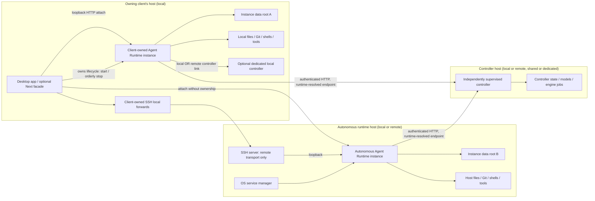
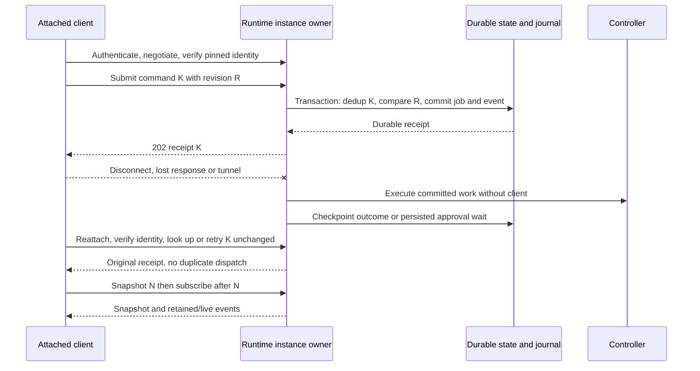
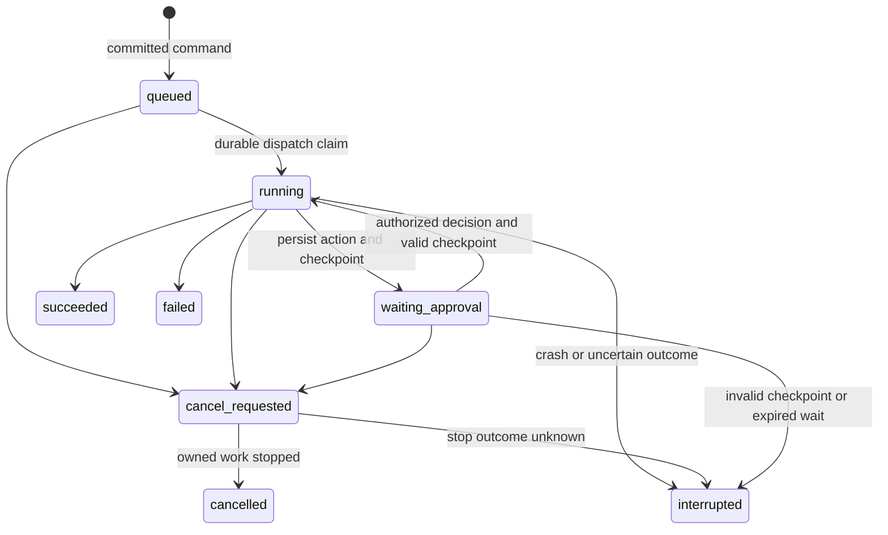

# ADR-0012: Agent Runtime lifecycle modes, ownership, and recovery contracts

Date: 2026-09-08, revised 2026-09-21. Scope:
[#12](https://github.com/urucoder/local-studio/issues/12),
under [#10](https://github.com/urucoder/local-studio/issues/10) and
[#3](https://github.com/urucoder/local-studio/issues/3).

**Status: confirmed architectural direction; proposed protocol and operational decisions
await owner approval.** Committing the schemas does not approve these proposals or
make the APIs available. This ADR replaces the lifecycle recommendation in
[PR #8](https://github.com/urucoder/local-studio/pull/8), not its historical evidence.
The PR documents were absent from this branch; they were inspected through the PR.

**2026-09-21 owner correction (confirmed):** the earlier revision required *every*
Agent Runtime instance to outlive all frontends. That is superseded. Client-owned and
autonomous runtime instances **coexist**, including on the same host; autonomy is a
per-instance lifecycle mode, never an application-wide or host-wide toggle. Sections
below mark each statement as existing code evidence, confirmed correction, or a
proposal awaiting approval.

## 1. Context and verified implementation

Source baseline: `0978c4a7329da9e70adb179aca14eb5e91411d2d`. The following are
observations about existing code, not autonomy or deployment acceptance:

| Evidence                                                                                                                                                                                                                                                                                                                                                                 | Current behavior and implication                                                                                                                                              |
| ------------------------------------------------------------------------------------------------------------------------------------------------------------------------------------------------------------------------------------------------------------------------------------------------------------------------------------------------------------------------ | ----------------------------------------------------------------------------------------------------------------------------------------------------------------------------- |
| [Desktop runtime launcher](../../frontend/desktop/logic/agent-runtime-server.ts#L63-L165), [app shutdown](../../frontend/desktop/logic/app-server.ts#L333)                                                                                                                                                                                                               | Electron forks/configures the runtime and can stop it with the app. This is today's only mode; it becomes the **client-owned local** mode, not a behavior every instance must keep. |
| [Runtime server](../../services/agent-runtime/src/server.ts#L6-L23), [systemd template](../../services/agent-runtime/systemd/local-studio-agent-runtime.service)                                                                                                                                                                                                         | Standalone entry point and scheduler exist. Loopback binding and immediate signal exit do not establish durable draining or full installation/reboot guarantees.              |
| [Runtime route registry](../../services/agent-runtime/src/http/app.ts#L166-L197) and frontend [connectors](../../frontend/src/app/api/agent/connectors/route.ts#L11), [plugins](../../frontend/src/app/api/agent/plugins/route.ts#L11), [projects](../../frontend/src/app/api/agent/projects/route.ts#L8), [skills](../../frontend/src/app/api/agent/skills/route.ts#L8) | These surfaces already have HTTP handlers/proxies. Do not redo those migrations. Audit remaining bypasses and host-side authorization instead.                                |
| [Project client](../../frontend/src/features/agent/projects/api.ts#L23-L65), [shell route](../../frontend/src/app/api/agent/terminal/route.ts#L1-L51)                                                                                                                                                                                                                    | Desktop project IPC still wins; the non-PTY shell route executes in Next. Existing HTTP coverage is not proof of consistent host ownership.                                   |
| [Controller configuration](../../services/agent-runtime/src/pi-runtime-models.ts#L219-L287)                                                                                                                                                                                                                                                                              | Runtime merges and persists controller settings. A forwarded client URL must not overwrite these server-side settings.                                                        |
| [Project store](../../services/agent-runtime/src/projects-store.ts#L23-L38)                                                                                                                                                                                                                                                                                              | Projects use `LOCAL_STUDIO_PROJECTS_FILE` or ancestor `data/agentfs/projects.json` discovery, independently of `LOCAL_STUDIO_DATA_DIR`.                                       |
| [Prompt submission](../../services/agent-runtime/src/http/handlers.ts#L191-L245), [automation execution](../../services/agent-runtime/src/automation-scheduler.ts#L150-L204)                                                                                                                                                                                             | Prompt acceptance already launches work separately, and schedules already execute without a stream consumer. Neither supplies the proposed durable receipt/recovery protocol. |
| [PTY service](../../services/agent-runtime/src/pty-service.ts#L49-L69), [subscription](../../services/agent-runtime/src/pty-service.ts#L232)                                                                                                                                                                                                                             | Shells outlive stream attachment and replay bounded output, but sessions and replay are in memory, not restart-durable. Existing exit cleanup removes sessions.               |
| [Connector extension](../../frontend/desktop/resources/pi-extensions/connectors.ts#L19), [CUA](../../frontend/desktop/resources/pi-extensions/cua.ts#L38), [subagents](../../frontend/desktop/resources/pi-extensions/subagents.ts#L21), [automations](../../frontend/desktop/resources/pi-extensions/automations.ts#L22)                                                | Required tool paths still use `LOCAL_STUDIO_FRONTEND_BASE`. Replace this dependency; an SSE subscription is not the same thing as a required callback server.                 |
| [OAuth vault](../../services/agent-runtime/src/oauth-vault.ts#L59-L109), [connector OAuth](../../services/agent-runtime/src/oauth-connectors.ts#L348-L433)                                                                                                                                                                                                               | The vault requires Electron-parent IPC. Device/PKCE flow machinery exists; that does not certify every provider for headless operation or migrate every secret store.         |
| [Runtime route registry](../../services/agent-runtime/src/http/app.ts#L125)                                                                                                                                                                                                                                                                                              | No KittyLitter gateway is established by this registry. Mobile protocol discovery, pairing, and independent ingress remain separate parent work.                              |

## 2. Confirmed decisions

### 2.1 Services, instances, and lifecycle modes

- Agent Runtime and controller remain **separate services** with distinct
  authoritative data roots and one writer service per root.
- An **Agent Runtime instance** is the unit of lifecycle ownership. Each instance
  has exactly one lifecycle mode, fixed for its lifetime unless an explicit,
  authorized mode change is performed:
  - **Client-owned:** a designated local client owns startup and orderly shutdown.
    The instance runs **only on the owning client's own host**; there is no remote
    client-owned runtime, and therefore no remote client-owned orphan policy.
  - **Autonomous:** the instance is independently supervised, may run locally or
    remotely, and survives every frontend exit, window close, and disconnection.
- **Client-owned and autonomous instances coexist**, including on the same host.
  Autonomy is per instance, never a global application or host setting.
- Users open a local-studio workspace **through a selected runtime instance**.
  Sessions inherit their owning instance's lifecycle. Attaching to a session never
  transfers ownership or changes its mode.
- **Attachment is not ownership.** Attach, detach, window close, HTTP/SSE loss, and
  SSH loss are never shutdown, cancellation, or ownership transfer in either mode.
  Only an explicit authorized operation stops work or moves a session between
  instances.
- **Human dependence is orthogonal to lifecycle autonomy.** An autonomous instance
  may pause for human approval; a client-owned instance may run unattended while its
  owning client remains alive.

### 2.2 Controller placement and ownership

- Runtime placement, runtime lifecycle ownership, and controller placement/ownership
  are **distinct**. In either lifecycle mode the controller may be local or remote;
  runtime and controller are not required to share a host.
- Connecting to a controller grants no lifecycle ownership. Stopping a runtime must
  not implicitly stop a shared or independently supervised controller.
- A **dedicated client-managed local controller** may explicitly follow its owning
  client's lifecycle. That is one deployment shape, not an assumption about every
  controller.
- Controller failure is a **dependency/readiness** condition, not lifecycle
  ownership transfer and not runtime death.

### 2.3 Valid placement matrix (confirmed)

| Runtime lifecycle | Runtime placement                 | Controller placement | Supported |
| ----------------- | --------------------------------- | -------------------- | --------- |
| Client-owned      | Local (owning client's host only) | Local                | Yes       |
| Client-owned      | Local (owning client's host only) | Remote               | Yes       |
| Client-owned      | Remote                            | Any                  | **No**    |
| Autonomous        | Local                             | Local                | Yes       |
| Autonomous        | Local                             | Remote               | Yes       |
| Autonomous        | Remote                            | Local                | Yes       |
| Autonomous        | Remote                            | Remote               | Yes       |

### 2.4 Execution placement and availability

- Projects, files, Git, terminals, connectors, agent tools, and workspace paths
  resolve and execute on the **Agent Runtime host**, wherever the controller runs.
  No automatic local/remote synchronization, matching-path substitution, silent
  local fallback, Mac worker, or mandatory reverse tunnel.
- Frontends are optional attachable HTTP clients, not mandatory in-process plugins.
  A local Next facade may serve a client; no runtime operation requires it.
- Local attachment uses loopback HTTP. SSH is the default remote transport.
  Contracts are transport-independent; Tailscale implementation is deferred.
- Only autonomous instances promise zero-frontend continuation. Client-owned
  instances promise continuation while their owner is alive, plus explicit
  drain/interruption semantics at owner shutdown.
- A sleeping/offline host cannot perform continuous work in either mode. Detach
  guarantees never imply crash, shutdown, reboot, or arbitrary-process recovery.

### 2.5 Coexistence safety (confirmed constraints)

- Every instance needs its **own authoritative data roots**; two instances must
  never be independent writers of the same root. A failed attachment is never a
  reason to launch a second runtime against an existing root.
- Two coexisting instances addressing **overlapping workspace files** require an
  explicit isolation/concurrency policy — for example separate Git worktrees or
  exclusive write ownership of a root. This ADR does not claim any implemented
  cross-instance file-locking guarantee.
- Changing an instance's lifecycle mode and transferring a session between
  instances are **explicit operations with their own authority**, never a side
  effect of attachment, reconnection, or window state.
- Management authority is separate from data-plane access: permission to submit
  jobs does not grant permission to stop an instance others depend on.

## 3. Target topology

Two runtime instances are shown coexisting: a client-owned local instance and an
autonomous instance, each with independently placed controllers.

Attachment arrows never imply lifecycle ownership. Scheduling, approval persistence,
and committed job execution have no dependency arrow to Clients in either mode;
for a client-owned instance the ceiling on that independence is its owner's process
lifetime, not any individual connection. A controller may be shared by instances in
different lifecycle modes, so stopping one instance must not stop it.
Service-management operations are explicit privileged actions, never part of
attach/detach. See [SSH attachment details](ssh-tunnel-modes.md).

## 4. Proposed decisions requiring owner review

All details below, including the v1 protocol, are **proposed**, not approved.

| Decision              | Recommendation                                                                                                                                                                                 | Trade-offs / alternative                                                                                                                                                                                                                                                                                |
| --------------------- | ---------------------------------------------------------------------------------------------------------------------------------------------------------------------------------------------- | ------------------------------------------------------------------------------------------------------------------------------------------------------------------------------------------------------------------------------------------------------------------------------------------------------- |
| First remote platform | Linux x86-64, Ubuntu 24.04 LTS, systemd system units running as a dedicated non-root account; separate runtime/controller units                                                                | Straightforward boot/logout independence; excludes initial Windows/remote macOS and container orchestration. A user unit requires explicit lingering.                                                                                                                                                   |
| Local supervisor (autonomous instances) | macOS launchd user services, independent of Electron                                                                                                                         | Survives app exit; user logout/pre-login execution is not guaranteed. A system daemon with a dedicated identity would change permissions and Keychain access. Client-owned instances are not supervised this way; their owner starts and stops them. |
| User/isolation model  | One trusted owner per runtime instance, multiple authenticated clients, one writer service per data root; workspace allowlists                                                                 | Not a multi-tenant sandbox. Tools share OS privileges; unrelated/untrusted users need separate OS accounts/instances or hosts. Coexisting instances on one host share OS privileges unless separated by account or container; containers are future isolation work, not implied by SSH. |
| Secret backend        | Service-owned encrypted vault; macOS Keychain-backed key access and Linux supervisor-provisioned key via systemd encrypted credentials, preferably TPM-backed                                  | No Electron IPC or renderer-held service secrets. Locked/unavailable keys block dependent capabilities. Unattended software-key fallback requires explicit risk acceptance and secure provisioning; never store the key beside ciphertext. Rotation, backup, and provider-specific stores need #19/#17. |
| OAuth                 | Provider-supported device authorization first; same-host loopback PKCE locally; remote loopback flows unavailable until an explicit provider-compatible callback transport is approved         | Device flow avoids callbacks but is not universal. A short-lived authorization ceremony can need a human/browser; refresh and already-authorized work must not need the frontend. No universal callback broker or mandatory reverse tunnel.                                                             |
| PTY lifetime          | Runtime owns PTYs, survives detach within one process lifetime; 1 MiB output ring, 24-hour idle expiry, explicit close, one renewable 30-second writer lease                                   | Bounded memory and orphan cleanup; not restart persistence. Output replay can truncate. Multiplexer-backed recovery is deferred.                                                                                                                                                                        |
| Concurrent clients    | Optimistic revisions, transactional compare-and-swap, one executing job per session; multiple observers; explicit PTY writer lease                                                             | Avoids silent last-writer-wins and duplicate turns. Conflicts require refresh/user intent; no offline merge or distributed active-active writer.                                                                                                                                                        |
| Recovery              | Persist accepted commands and state before acknowledgement; recover queued jobs and valid approval waits; mark uncertain running work interrupted, never automatically rerun arbitrary effects | Conservative and auditable; loses seamless running-process recovery. Requires durable transactions, reconciliation and operator-visible repair, not only process restart.                                                                                                                               |
| Retention             | Workspace events: 7 days or 64 MiB, whichever first; command receipts: at least 7 days and through command expiry; resources until explicit authorized deletion                                | Replay is bounded, snapshots remain authoritative. Quotas/backpressure must reject new work before violating promised durable receipt retention.                                                                                                                                                        |
| Schedule downtime     | UTC interval/one-shot coordination contract; skip missed occurrences and record the skip, then resume future intervals                                                                         | Prevents a reboot catch-up burst. Existing daily/weekly schedules retain their existing contract pending explicit #17 mapping; no lossy automatic conversion.                                                                                                                                           |
| Client-owned shutdown trigger | Distinguish window close from owner-application quit: closing the last window does not stop the instance while the owning application runs; quitting requests an orderly drain                | Preserves today's integrated feel without treating UI state as lifecycle. Needs an explicit, visible choice ("quit and stop this runtime" versus "keep running"); the wording and default are unapproved. |
| Client-owned orphan handling (proposal only) | Owner heartbeat/lease with a grace period; on a crashed owner the instance keeps committed work, refuses new commands after the grace period, and surfaces an adoptable orphan state | Prevents both instant data loss and invisible zombies. Grace period, adoption authority, and whether an orphan may be promoted to autonomous are **undecided**; ordinary transport loss must never trigger this path. |
| Mode change and session transfer | Explicit authorized operations with their own management authority; source instance drains or refuses the affected sessions before handoff                                         | Keeps ownership auditable. Requires state handoff and dedup/journal rules across instances; not designed here and not part of the v1 command set. |
| Overlapping workspace roots | Reject or require explicit isolation (separate worktrees, or exclusive write ownership recorded per root) before two instances resolve the same path                             | Avoids silent concurrent-writer corruption. Detection strategy, scope (same host only versus shared network storage) and enforcement point are unapproved; no cross-instance locking exists today. |

## 5. Proposed v1 API and state contract

The single definition is
[`shared/agent/autonomous-core-v1.ts`](../../shared/agent/autonomous-core-v1.ts).
It uses Effect Schema and Effect decoders; it adds **no production routes** and
does not replace existing `/api/agent/*` or controller APIs. Protocol versions are
independent of desktop release/package versions and persisted database versions.

### Identity, resolution, readiness, and connection

- `CoreIdentityV1Schema`: five stable opaque, canonical lowercase UUIDs: `coreId`
  (the installed runtime+controller pairing, one per instance, **not** per host),
  `runtimeHostId` and `controllerHostId` (enrolled execution hosts, not DNS names;
  equal when co-located), `runtimeId`, `controllerId`.
  Allocate and persist them during provisioning, before serving requests. Renaming
  a host, changing ports, credential rotation, and normal restart do not change them.
  Two instances coexisting on one host share a host identity but never a `coreId`,
  `runtimeId`, or data root. Per-service `instanceId` changes on process restart;
  it is null when no instance is known — stable installation identity and process
  instance identity remain distinct. A cloned/restored instance on another host must
  be re-enrolled, not run concurrently with copied identities. Restore invalidates
  journal epochs.
- A profile pins the **full** identity after explicit authenticated enrollment,
  including both host identities, so a remote controller cannot be silently swapped
  for a local one. SSH host-key verification and application identity checks are
  both required. A process answering on the expected port is not enough — with
  coexisting instances, port ownership proves even less than before. A mismatch
  blocks attachment/mutation; never silently update the pin or substitute another
  instance.
- `CoreLifecycleV1Schema` (inside discovery) declares the instance's `mode`,
  its `runtimeOwner` (`ownerClientId` + `ownerHostId`, null exactly when autonomous),
  `controllerPlacement`, `controllerOwnership`
  (`independent-supervisor`, `shared`, or `client-managed-dedicated`), and
  `survivesFrontendExit`. Decoding enforces the confirmed rules: only client-owned
  instances have an owner, only autonomous instances advertise
  `survivesFrontendExit`, an owner's host equals `runtimeHostId` (client-owned is
  local only), `controllerPlacement` agrees with the pinned host identities, and a
  `client-managed-dedicated` controller exists only for a client-owned instance on
  the runtime host. Lifecycle is server-declared; clients never infer it from
  connection state.
- `WorkspaceV1Schema` identifies a workspace by **instance identity + workspaceId**,
  with a revision and host-local absolute root that is always resolved on the
  **runtime** host, never the controller host or the client host. Paths are
  display/host resolution data, not client authorization. Only the runtime resolves
  canonical roots and validates each relative operation, symlinks, grants, and
  resource relationships. A valid schema is not an authorization check, and it is
  not a cross-instance lock on an overlapping directory.
- `ControllerResolutionV1Schema` is an administrative, runtime-owned view of
  versioned service settings and credential availability. `serverEndpoint` is
  resolved **by and for the runtime host** and may address a local or remote
  controller; `placement` must agree with the pinned host identities. Runtime
  verifies the paired controller's identity before inference. Client forwarding
  endpoints live only in `CoreConnectionV1Schema`, never in server settings;
  renderer payloads never contain controller credentials.
- `CoreReadinessV1Schema` separates process liveness from operational readiness and
  reports the instance `lifecycleMode`. `ready` requires usable storage, completed
  compatible migrations, required keys and verified controller linkage. Commands are
  conservatively admitted only when both services are ready and `acceptsCommands` is
  true; draining/blocked instances still permit authorized inspection. Degraded
  capabilities explain unavailable functions. A controller outage — local or remote
  — does not imply the runtime process or its local file APIs died, and never moves
  lifecycle ownership.
- `CoreConnectionV1Schema` is **client-local state**, not instance job ownership.
  It records `clientId`/`clientHostId`, the pinned `expectedCore`,
  `expectedLifecycleMode`, and this client's `role`: `lifecycle-owner` or
  `attached`. Decoding rejects a `lifecycle-owner` role unless the expected mode is
  client-owned and the client's host is the runtime host. State progresses
  detached → connecting → authenticating → checking-identity → attached; transport
  loss becomes reconnecting, invalid auth/identity/version/lifecycle becomes blocked
  (`lifecycle-mismatch` covers an instance whose advertised mode or owner differs
  from the pinned profile). Cached observations must be visibly stale, never proof
  of current readiness. No connection-state update starts, cancels, adopts, or
  releases service work.

### Endpoint proposal

All data routes require application authentication and workspace/resource
authorization, even on loopback or through SSH. Anonymous liveness reveals no
identity, paths, credentials, or user activity. A deployment's Host/origin/CSRF
policy belongs to #14; SSH authentication alone is not HTTP authorization.

| Proposed endpoint                                                            | Boundary / behavior                                                                                                                           |
| ---------------------------------------------------------------------------- | --------------------------------------------------------------------------------------------------------------------------------------------- |
| `GET /health` on each service                                                | Minimal process liveness only; existing runtime shape is not a readiness promise                                                              |
| `GET /.well-known/local-studio-core` on each service                         | Authenticated `CoreProtocolAdvertisementSchema`: stable identity and nonempty unique supported protocol versions; immutable negotiation shape |
| `GET /api/core/v1/discovery` on runtime                                      | `CoreDiscoveryV1Schema`: v1 payload, proposal marker, versions, **lifecycle mode/owner/controller placement**, capability availability and enforced retention limits |
| `GET /api/core/v1/readiness` on runtime                                      | `CoreReadinessV1Schema`, including lifecycle mode and paired local-or-remote controller observation; 503 when not accepting commands          |
| `GET /api/core/v1/controller-resolution` on runtime                          | Administrative `ControllerResolutionV1Schema` with runtime-resolved placement; never raw credential values or client-forwarded addresses      |
| `GET /api/core/v1/workspaces/:workspaceId` on runtime                        | `WorkspaceV1Schema`; scoped host identity, never client filesystem inspection                                                                 |
| `POST /api/core/v1/commands` on runtime                                      | `CoreCommandV1Schema` → durable `CoreCommandReceiptV1Schema`; 202 first acceptance, 200 same-command receipt                                  |
| `GET /api/core/v1/commands/:commandId` on runtime                            | Authorized receipt lookup after an uncertain response; 404 is not proof a command never ran after retention/restore                           |
| `GET /api/core/v1/workspaces/:workspaceId/activity` on runtime               | Atomic `ActivitySnapshotV1Schema` at a journal cursor                                                                                         |
| `GET /api/core/v1/workspaces/:workspaceId/events?epoch=…&after=…` on runtime | SSE `ActivityEventV1Schema` records after cursor; parse path/query and authenticated identity into `ActivityReplayRequestV1Schema`            |

Choose the highest mutually supported version from the advertisement before decoding
versioned data. No intersection means blocked/version-mismatch, not best-effort
parsing or downgrade to legacy handlers. V1 rejects unknown fields/discriminants;
evolution requiring new fields needs a new negotiated version, not a minor package
bump. The proposal marker must be revised through owner review before stabilization.
Older stored-state formats require an explicit migration, backup, and compatible
reader; do not reinterpret incompatible data or auto-downgrade it on startup.

Instance lifecycle management — starting, stopping, draining, changing a lifecycle
mode, adopting an orphaned client-owned instance, or transferring a session between
instances — is deliberately **not** in this data-plane API. It needs separate
management authority and its own proposal; a data-plane token must not stop an
instance that other clients depend on.

Use `coreBoundaryV1(expectedIdentity)` for strict Effect decoding and identity
matching of commands, discovery, workspaces, receipts, snapshots, and events.
It rejects malformed UUIDs, non-v1 envelopes, extra properties, invalid command
variants, noncanonical UTC timestamps, cross-workspace activity resources, and
lifecycle declarations that contradict the pinned host identities (for example a
client-owned instance claiming an owner on another host, or a `runtime-host`
controller placement with differing host identities).
Transport code must additionally compare path/query workspace IDs, check identity
against its provisioned configuration, enforce byte/count limits before decoding,
and perform authorization and transactional state validation before effects.
Decoding proves payload shape only; it proves no stateful, storage, or lifecycle
guarantee.

`CoreErrorV1Schema` is the authenticated v1 error envelope, with redacted messages.
Use 400 invalid-payload; 401 unauthenticated; 403 forbidden; 404 not-found;
409 identity/version/lifecycle/revision/idempotency/writer-lease conflict; 410 expired
command/approval/cursor; 422 unsupported-capability; 503 not-ready.
`lifecycle-mismatch` reports an instance whose advertised mode, owner, or controller
placement no longer matches the pinned profile; it is a blocking mismatch, never an
invitation to re-enroll automatically or to fall back to another instance.
Before negotiation/authentication, use HTTP status without identity-bearing detail
(unsupported version: 406 and the authenticated advertisement). Clients never
trust an error body to replace a pinned identity. A malformed versioned payload
is a protocol error, not a transient connection failure.

### Commands, deduplication, and concurrent mutation

- Commands contain identity/version, UUID `commandId`, canonical UTC `issuedAt`
  and `expiresAt`, and a discriminated `body`. Proposed acceptance window: at most
  24 hours from issue, five-minute future-clock tolerance. Validate with server
  time; reject expired unknown commands. These temporal rules require a clock and
  belong to handlers, not the structural schema.
- Supported coordination commands: `job.submit`, `job.cancel`, `schedule.put`,
  `schedule.delete`, `approval.resolve`, `terminal.open`, `terminal.close`,
  `terminal.claim`, `terminal.input`. They are not arbitrary method/path forwarding.
  Rich turn inputs, session creation, file/Git mutations and terminal resize/output
  use their domain contracts in sibling work; v1 does not silently reinterpret
  existing turn/session identifiers or daily/weekly schedules.
- Every command carries `workspaceId` and `expectedRevision`. For `job.submit`
  compare the existing session revision and create the job; for other commands
  compare the addressed schedule/job/approval/terminal revision. Zero means
  create-if-absent only (`schedule.put`, `terminal.open`); other targets must exist.
  Validate referenced session/job belongs to that workspace. `schedule.delete`
  produces a revisioned tombstone; an accepted receipt is not proof of completion.
- Dedup key: authenticated principal + coreId + commandId, independent of HTTP
  connection/client instance, and scoped to one runtime instance. Receipts, journals,
  and dedup ledgers never span instances, so a transferred session cannot reuse the
  source instance's command IDs. Atomically store the canonical decoded command digest,
  receipt, state transition and journal entry before acknowledgement; dispatch
  queued work only from committed state. Concurrent first submissions serialize.
  Same key and payload returns the original resource/revision, with `deduplicated`
  true; different payload returns idempotency-conflict even after state changes.
  Look up a retained receipt before current expiry/revision checks, but recheck
  current authorization before revealing it.
- Keep the receipt/digest through at least max(7 days after commit, command expiry).
  After pruning, old commands are expired, never silently fresh submissions.
  On timeout, retry only the identical command/key within this guarantee or inspect
  the receipt/activity; never mint a fresh ID as an automatic transport retry.
  External tools, inference calls, PTY input, and Git/network effects are **not
  exactly-once**. A crash between an effect and its checkpoint can leave uncertainty.
  Retried receipts do not replay those effects; operator reconciliation is required.
- Compare-and-swap and dedup checks run in the same owner transaction. No silent
  last-writer-wins. A job creation advances the session revision and occupies its
  execution slot; conflicting submissions get revision-conflict, not an implicit
  steer or parallel turn. Explicit scheduling policy decides later queued work.
- `terminal.claim` grants/renews a lease only to its authenticated holder, or claims
  an expired lease; another live holder gets writer-lease-conflict. `terminal.input`
  requires its lease ID, holder identity, unexpired server-side lease, and matching
  terminal revision. Lease renewal is independent of HTTP stream lifetime.
- Approval resolution binds the exact persisted `actionDigest`, approval revision,
  expiry, job and workspace. Only a valid pending wait can transition once.
  Human absence leaves it pending; expiry fails closed. Cancellation invalidates
  pending approvals; race resolution is transactional, never a late tool grant.

### Activity and replay

Snapshots contain typed job/session/schedule/terminal/approval summaries, not
secrets or full tool output. Events are typed resource upserts or revisioned
tombstones. The workspace journal has a durable random `epoch` and strictly
increasing safe-integer `sequence`. Snapshot at N is a consistent view of all
authorized resources in that workspace; replay starts at N+1 without a gap.
Persist journal and resource changes together. Normal service restart preserves
the epoch; restore/reset changes it. Rotate the epoch before sequence overflow.

Use SSE id `epoch:sequence`. Heartbeats carry no state and consume no sequence.
Delivery is at-least-once; clients ignore already applied cursors/revisions.
On a gap, backwards revision, mismatched identity/workspace, unknown event shape,
expired cursor, or changed epoch, stop applying deltas and fetch a fresh snapshot.
Do not mix epochs or infer missing transitions. A too-old or ahead-of-server cursor
gets 410 cursor-expired before streaming. Stream-time reset closes the stream and
requires a new snapshot. Slow clients are disconnected rather than pinning retention.
Capability or authorization changes also close affected subscriptions and require
rediscovery/resnapshot; activity is scoped to one authorized workspace, not a
cross-workspace feed. PTY byte replay is separate from this activity journal.

The sequence below holds for both lifecycle modes. The only difference is the
ceiling on independence: an autonomous instance continues with zero frontends, while
a client-owned instance continues until its owning client performs an explicit
orderly shutdown. Neither disconnect nor window close appears in this flow.

## 6. Proposed ownership and failure semantics

| Resource                                        | Authoritative owner                        | Detach behavior                      | Explicit termination / durable state                                                                                   |
| ----------------------------------------------- | ------------------------------------------ | ------------------------------------ | ---------------------------------------------------------------------------------------------------------------------- |
| Agent jobs and subagents                        | Runtime worker, never request Effect scope | Continue supported work              | Cancel command requests cooperative stop; persisted receipt, status, checkpoints, parent/child linkage                 |
| Model serving, downloads, engine jobs           | Controller                                 | Continue independently               | Controller management API owns cancellation/drain; runtime must reconcile outcomes, not infer them from a lost request |
| Schedules                                       | Runtime scheduler                          | Continue firing without observers    | Pause/delete affects future fires, not already-created jobs; explicit job cancellation is separate                     |
| Sessions/transcripts                            | Runtime                                    | Remain readable/attachable           | Durable session metadata/transcripts; no implicit end on window close, one executing writer                            |
| PTYs and their children                         | Runtime PTY manager                        | Keep running subject to idle expiry  | Explicit close or expiry; runtime restart loses handle/buffer, never promises process resurrection                     |
| Approval waits                                  | Runtime durable job state                  | Remain pending until decision/expiry | Persist action digest, principal policy and expiry; cancel invalidates; never auto-approve                             |
| Cancellation intent                             | Owning service                             | Continues processing intent          | Job state cancel-requested → cancelled only after stop acknowledgement; interruption/partial effects remain visible    |
| Frontend caches, selected profile, SSH forwards | Client                                     | Discard/reconnect locally            | No authority over service lifecycle, jobs, workspaces or controller settings                                           |
| Runtime instance lifecycle                      | Owning client (client-owned) or OS supervisor (autonomous) | Unchanged by detach; a non-owning attach never acquires it | Explicit owner quit or authorized management action; mode changes and session transfers are separate explicit operations |
| Controller lifecycle                            | Its own supervisor, or the owning client only when the controller is dedicated and client-managed | Unchanged by detach or by a runtime stopping | Stopping a runtime never stops a shared or independently supervised controller, local or remote |
| Workspace paths and host execution              | Runtime host of the owning instance        | Unaffected                           | Controller placement never moves file/Git/terminal/tool execution; no sync or client-side fallback                     |

| Event                                                      | Proposed guarantee and required response                                                                                                                                                                                                                                                    |
| ---------------------------------------------------------- | ------------------------------------------------------------------------------------------------------------------------------------------------------------------------------------------------------------------------------------------------------------------------------------------- |
| Attach/detach, HTTP/SSE disconnect, SSH loss, client sleep, window close | Services and committed work continue in **both** modes. Not a shutdown, cancellation, mode change, or ownership transfer. Writer leases may expire, not kill terminals. Reattach by identity and cursor.                                                             |
| Owning client quits (client-owned instance)                | Owner requests an orderly shutdown: drain, reject new commands, persist state, then stop. Unfinished work becomes interrupted under the shutdown semantics below. Non-owning attached clients simply lose the instance; they never inherit ownership. Closing a window while the owning application keeps running is not this event. |
| Owning client crashes (client-owned instance)              | **Proposal, not approved.** Committed state stays durable and the instance does not silently vanish; a lease/heartbeat grace period, adoption authority, and any promotion path must be decided in #13/#14. Ordinary transport loss must never enter this path. Autonomous instances are unaffected — they have no owning client. |
| Frontend exit with zero frontends remaining               | Autonomous instances continue indefinitely. Client-owned instances continue only while their owning application process is alive; this ADR makes no zero-frontend promise for them.                                                                                  |
| Explicit job cancellation                                  | Persist intent, stop new child/tool dispatch, request owned-child termination and invalidate waits. Completion racing cancellation remains succeeded if already committed. Cannot undo completed external effects; never report cancelled merely because the request socket closed.         |
| Graceful service shutdown                                  | Enter draining, reject new commands, persist pending state, bounded 30-second drain then stop owned process groups. Unfinished work becomes interrupted. Shutdown requires explicit management authority or, for a client-owned instance, its owner's explicit quit — never an incidental frontend lifecycle hook such as a lost stream or a closed window. |
| Runtime crash / forced kill                                | Supervisor restarts service. Validate storage and reconcile incomplete commands before ready. Recover committed queued work once through the dispatch ledger; running/cancel-requested work with uncertain effects becomes interrupted. PTYs become lost even if orphan processes survived. |
| Controller-only crash or loss of a remote controller link | Runtime stays available for inspection and host-local operations; mark dependency blocked and reject new coordinated commands. This is readiness degradation, never lifecycle ownership transfer or a reason to stop the runtime. Reconcile in-flight inference/engine jobs by stable IDs after recovery; no blind resubmission or silent failover to another controller. |
| Host reboot/power loss                                     | Both process lifetimes end; use crash reconciliation. Durable data survives only within filesystem/storage guarantees. Remote services may boot automatically; local user services/keys may require login. No replay of arbitrary running tools or shells.                                  |
| Runtime host sleep                                         | Work pauses; connections may time out. On wake recheck clocks, readiness, leases, approval expiries, schedules, and external outcomes. Skip missed occurrences under the proposed schedule policy. A local host — client-owned or autonomous — must stay awake for continuous work; only a remote autonomous host removes that limit. |
| Disk full/corrupt/incompatible store                       | Stop admissions; do not acknowledge uncommitted work or erase receipts to make room. Surface blocked readiness and repair/restore requirements. Never silently start with an empty replacement store.                                                                                       |
| Restore/host replacement                                   | Stop the old writer, restore coordinated backups, re-enroll a changed host, rotate journal epoch and reconcile external effects. Receipt rollback can invalidate dedup guarantees: forbid automatic resend of pre-restore commands, even if unexpired.                                      |
| Two instances resolving overlapping workspace paths        | Not solved by this contract. Coexistence is safe only with separate data roots plus an explicit isolation policy (separate worktrees or exclusive write ownership). Without it, concurrent writes are an operational hazard, not a guaranteed-safe configuration.                            |

Queued jobs may restart only if the ledger proves execution never began. A durable
pending approval may recover only if its action/context remains verifiable and
authorization/expiry still permits it; otherwise invalidate it and interrupt the
job. This is not automatic resumption of arbitrary stack frames. Persist scheduler
occurrence IDs (schedule ID + schedule revision + nominal UTC fire time) before
dispatch so two scheduler ticks/restarts do not create the same occurrence twice.

Diagram underscores render the wire states `waiting-approval` and `cancel-requested`.
Interrupted work requires explicit reconciliation/new user intent, not automatic
reexecution under a new command ID.

## 7. Proposed capability matrix

Discovery must report each known capability once; absence means unsupported.
`available` means provisioned and authorized now, not merely compiled in;
`requires-setup`, `unavailable`, and `unsupported` need a reason. `autonomous`
means the capability needs **no attached frontend** while it executes; it does not
promise availability, and it does not override the instance's lifecycle mode. The
lifecycle ceiling is separate and declared once per instance: client-owned work
survives detachment but not its owner's quit, while autonomous work survives every
frontend exit. Client-executed capabilities can never advertise autonomy. Refresh
discovery after reconnect or any advertised change.

| Capability                                              | Client-owned instance (runtime local only)                            | Autonomous instance (runtime local or remote)                   | Detach / lifecycle boundary                                                                                       |
| ------------------------------------------------------- | --------------------------------------------------------------------- | --------------------------------------------------------------- | ----------------------------------------------------------------------------------------------------------------- |
| Background jobs, schedules, approvals, replay           | Target supported while the owning application runs                    | Target supported with zero frontends                            | Service-owned persistence and worker; #18, not implemented by this ADR                                            |
| Files, Git, projects, shells, workspace paths           | Owning client's local host workspace                                  | Runtime host workspace, local or remote                         | Always the runtime host, never the controller host or a client-local substitution                                 |
| Controller placement                                    | Local or remote, runtime-resolved                                     | Local or remote, runtime-resolved                               | Controller link is a dependency; its loss degrades readiness only                                                 |
| PTY reattachment                                        | In-process, bounded replay                                            | Same                                                            | Requires PTY module/shell; no crash/reboot continuity; owner quit ends client-owned PTYs                          |
| Connectors, plugins, skills                             | Host-installed and authorized                                         | Host-installed and authorized                                   | Existing HTTP routes retained; callbacks/resources must be made headless                                          |
| OAuth device authorization                              | Proposed supported for provider-approved flows                        | Same                                                            | Human may authorize on any browser; the runtime polls and owns refresh secrets                                    |
| OAuth loopback/PKCE                                     | Proposed supported on the runtime host with service-owned callback and vault | Supported locally; unsupported for a remote runtime until a provider-compatible callback transport is approved | Do not assume Google or any Pi provider supports device flow; device/PKCE machinery is not provider certification |
| Headless browser/CUA                                    | Host browser if installed                                             | Host browser if installed                                       | Runtime-host browser/resources; no Next callback or interactive-desktop dependency                                |
| Personal Chrome / Obsidian / host integrations          | Only resources available to the runtime identity                      | Only resources actually installed on the runtime host           | Never the client's tabs/vault; conditional host capability, not universal support                                 |
| Native reveal/open, file dialogs, desktop notifications | Optional client UX                                                    | Optional client UX, not runtime-host workspace execution        | Client-only, non-autonomous; no runtime task waits for them                                                       |
| Unattended work while the owner is signed in            | Supported: human dependence is not implied by client ownership        | Supported                                                       | Approval waits are a policy choice in either mode, not a lifecycle property                                       |
| Continuation with zero frontends                        | **Not promised**                                                      | Target supported                                                | The only lifecycle-mode capability difference                                                                     |
| KittyLitter/mobile gateway                              | Unverified / unsupported advertisement                                | Unverified / unsupported advertisement                          | Separate protocol/pairing/ingress work; no claimed mobile acceptance                                              |

API credentials already provisioned on the runtime host can support headless
providers without OAuth. Exact OAuth provider allowlists, scopes, key unlocking,
browser network policy, and credential migration must be approved in #14/#19 before
marking those capabilities available. This ADR does not certify today's secret
storage, and coexisting instances on one host do not share a credential store.

## 8. Implementation order and acceptance handoff

1. Owner reviews the proposed decisions in section 4 — especially client-owned
   shutdown triggers, orphan handling, mode change/session transfer, and overlapping
   workspace isolation. #12 contracts are the coordination baseline, not permission
   to ship an unauthenticated endpoint.
2. #13 supervision/identities and #14 authentication/provisioning must allocate
   per-instance identities and data roots so client-owned and autonomous instances
   coexist on one host, and must define the management authority that lifecycle
   operations require. #15 covers authoritative state and local-or-remote controller
   routing without coupling controller placement to runtime ownership.
3. #16 host workspaces/PTYs, #11 headless callbacks/resources, and #19 secrets/OAuth
   can proceed against that boundary; #18 adds durable jobs/approvals/activity.
4. #17 migration requires the final storage/secret formats and backup/rollback
   policy; approve it before changing existing local users' lifecycle/data. Today's
   Electron-launched runtime becomes a client-owned instance; it is not converted to
   an autonomous one implicitly.
5. #20 attachable clients consume those contracts, including instance selection when
   opening a workspace and the visible distinction between "quit and stop this
   runtime" and "disconnect; the runtime keeps running". #21 SSH management follows
   authenticated manual attachment, never substitutes for service autonomy.
6. #22 validates each mode separately: zero-frontend continuation for autonomous
   instances, owner-bounded continuation and orderly drain for client-owned
   instances, coexistence of both on one host, local-and-remote controller
   placement, failure/recovery, and deployment limits. Mobile acceptance under #3
   remains independent.

This PR contains the ADR, diagrams, ownership/failure tables, capability matrix,
and executable proposed schemas. It does not implement supervisors, production
endpoints, SSH infrastructure, storage/transactions, migrations, or UI flows.

**Unmet #12 acceptance:** new automated contract tests are not added because
`AGENTS.md` (verified on this branch, 2026-09-21) states "NEVER WRITE TESTS".
Existing runtime tests do not cover this new protocol. When authorized, coverage
must include malformed/mismatched identities, versions, discriminated commands,
extra fields, duplicate/conflicting submissions, revision races, activity
workspace/epoch/cursor mismatches, retention/restore boundaries, and the lifecycle
invariants (client-owned instances with a non-local owner host, autonomous instances
advertising an owner, and controller placement that contradicts pinned host
identities). Schema decoding proves payload shape only: lifecycle ownership,
coexistence safety, drain behavior, and recovery are stateful guarantees that need
implementation acceptance in sibling tasks.
