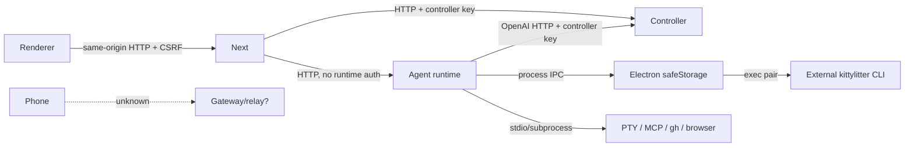

# Network and trust map

## Proven hops

| From → to                        | Transport / address                                                    | Authentication and trust                                                                                                                             |
| -------------------------------- | ---------------------------------------------------------------------- | ---------------------------------------------------------------------------------------------------------------------------------------------------- |
| Browser/Electron renderer → Next | HTTP, desktop loopback stable port; web deployment-defined             | Frontend token/Tailscale policy in `frontend/src/proxy.ts`; CSRF cookie/header on mutations from `app/layout.tsx`; desktop origin is locally trusted |
| Next → agent runtime             | HTTP configured by `LOCAL_STUDIO_AGENT_RUNTIME_URL`, normally loopback | No runtime credential. Next enforces access before forwarding; runtime checks only that `Host` is loopback (`http/app.ts`, `isLoopbackHost`)         |
| Next → controller                | HTTP(S) through `/api/proxy/*`                                         | Controller API key selected in `proxy-target.ts` and attached by proxy headers; controller `createAuthMiddleware` validates it                       |
| Agent runtime → controller       | HTTP(S), saved `backendUrl`; `${url}/v1`                               | saved controller `apiKey`; `pi-runtime-models.ts` probes `/v1/models` and configures Pi                                                              |
| Electron → Next/runtime children | process fork, stdio, signals                                           | same OS user and inherited environment                                                                                                               |
| Runtime → Electron OAuth vault   | Node child-process `process.send`/`message`                            | parent-child process relationship and request IDs; Electron `safeStorage` encrypts disk values (`oauth-vault.ts` in both packages)                   |
| Runtime → local tools            | subprocess/stdio for MCP, PTY, `gh`; browser protocol                  | host OS permissions; connector grants constrain model tool calls but are not an OS sandbox                                                           |
| Browser → Google OAuth callback  | provider redirects to ephemeral `http://127.0.0.1:<port>/callback`     | OAuth state/code (`google-oauth-loopback.ts`)                                                                                                        |
| Electron/Next → `kittylitter`    | local `execFile(..., ["pair"])`                                        | OS executable discovery; output schema validation only                                                                                               |

The runtime's loopback Host check was explicitly written as DNS-rebinding
protection (`services/agent-runtime/src/http/app.ts:109-131`). It is not enough
for remote exposure: every route includes capabilities such as shell, files,
browser control, connectors, and agent turns.

## Unproven mobile/gateway hops

No phone → gateway, gateway → runtime, or gateway → controller implementation
exists in this checkout. In particular, there is no evidence for the issue's
claimed secret-authenticated `/api/litter-bridge/v1` surface or calls to
controller `/health`, `/status`, `/gpus`, and `/v1/metrics/vllm`. Those
controller endpoints exist or are consumed by the frontend, but that does not
prove a gateway calls them.

The only proven pairing data is `{v,node_id,token,host_name?,relay?}`. The
meaning of `token`, the destination encoded by `node_id`, and the optional
`relay` protocol belong to the unavailable external implementation.

## Trust consequences

- A remote runtime needs authenticated service-to-service transport,
  authorization scopes, TLS, rate limits, audit logs, and credential rotation
  before its bind/Host policy can safely change.
- Controller keys must not double as runtime or device keys.
- Pairing should issue short-lived, single-use bootstrap material that becomes
  a revocable device identity; this is a recommendation, not current behavior.
- Remote filesystem, PTY, browser, plugins, and connectors execute with the
  runtime host user's authority.
- Next-host `/api/agent/fs`, git, directories, and terminal handlers create a
  second execution boundary and must not silently operate on a different host.
