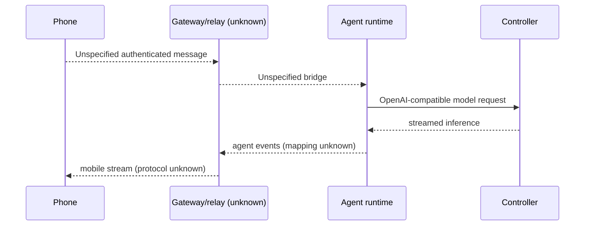

# End-to-end walkthroughs

## 1. Desktop cold start

1. Electron `main.ts` `run` takes a single-instance lock, registers app/process
   listeners and `registerIpcHandlers`, then waits for `app.whenReady()`.
2. `bootstrap` asks `app-server.ts` `startFrontendServer` for a server. Dev mode
   reuses `LOCAL_STUDIO_DESKTOP_DEV_SERVER_URL`; packaged mode clears a stale
   PID and selects/persists a loopback port.
3. `startOrReuseAgentRuntime` probes `/health`; otherwise
   `agent-runtime-server.ts` forks `dist/standalone.mjs` with the Electron data,
   Pi, project, resource, CWD, and frontend paths.
4. `server.ts` starts the automation scheduler, creates Hono, starts the
   session watcher, and listens on loopback.
5. Electron registers the child-process OAuth vault and waits for runtime
   health. Then `app-server.ts` forks Next standalone `server.js`, injecting
   `LOCAL_STUDIO_AGENT_RUNTIME_URL`, and waits for the frontend.
6. `window-manager.ts` creates a context-isolated window and loads the stable
   URL. The root layout installs CSRF handling; React providers mount.
7. On quit, `main.ts` `shutdown` stops monitoring/hotkeys/PTYs and asks
   `stopFrontendServer` to terminate Next and the runtime, escalating from
   `SIGTERM` to `SIGKILL`.

## 2. KittyLitter pairing by QR

```mermaid
sequenceDiagram
  participant U as User
  participant UI as Settings renderer
  participant E as Electron main
  participant N as Next pairing route
  participant K as kittylitter executable
  participant P as Phone
  U->>UI: Open “Connect your phone”
  alt Electron bridge available
    UI->>E: desktop:get-kittylitter-pairing-json
    E->>K: execFile("kittylitter", ["pair"])
  else web fallback
    UI->>N: POST /api/kittylitter/pairing
    N->>K: execFile("kittylitter", ["pair"])
  end
  K-->>UI: JSON v,node_id,token,host_name?,relay?
  UI->>P: render QR; phone scans
  Note over P: Subsequent destination and protocol are not in this repository
```

`profile-settings.tsx` `loadPairing` prefers preload IPC and falls back to the
Next route. `kittylitter-pairing.ts` searches fixed executable locations,
retries `pair`, validates fields, and returns the normalized JSON. It does not
read a gateway metadata file in this code. The phone's next action is unknown.

## 3. Phone-initiated agent turn

This sequence **cannot be traced end to end from this checkout**. There is no
mobile client, gateway endpoint, bridge handler, or adapter into
`handleAgentTurn`. The first proven local step for any agent turn is Hono
`POST /api/agent/turn` (`http/app.ts`) calling `handleAgentTurn`
(`http/handlers.ts`). Whether a phone reaches that endpoint, another controller
endpoint, or an external relay is an open protocol question.



## 4. Desktop-initiated agent turn

1. Workbench posts a turn to `/api/agent/turn`
   (`frontend/src/features/agent/runtime/api.ts` and workspace hooks).
2. The Next route runs `requireApiAccess`, applies the shared turn-body limit,
   and calls `proxyToAgentRuntime` (`app/api/agent/turn/route.ts`).
3. The proxy builds the same path at `LOCAL_STUDIO_AGENT_RUNTIME_URL`, strips
   hop-by-hop headers, and streams both request and response semantics.
4. Runtime Hono dispatches to `handleAgentTurn`, which validates the request
   contract and calls the singleton Pi runtime manager.
5. `pi-runtime.ts` creates/reuses a Pi session using options from
   `pi-runtime-helpers.ts`; `pi-runtime-models.ts` resolves the selected model
   and controller.
6. Pi calls the controller's OpenAI-compatible `/v1` provider with its API key.
   Runtime events/tool calls are encoded into the streamed response back
   through Next to Workbench.

## 5. Change a setting or add a connector

**Setting:** the renderer posts `{backendUrl,apiKey}` to `/api/settings`.
`frontend/src/app/api/settings/route.ts` authenticates, validates JSON, and
calls runtime `applySettingsUpdate` **in the Next process**. The service
atomically replaces that host's `api-settings.json`, masking the key on reads.
The actual remote runtime is not notified, which is why this route blocks
remote operation.

**Connector:** integrations post to `/api/agent/connectors`. The Next route
authenticates and proxies HTTP. Runtime `handleConnectorUpsert` validates the
connector contract and `connectors-service.ts` atomically updates
`connectors.json`; `connector-pool.ts` starts/reuses its MCP transport. Grants
are separately stored by `connector-grants.ts`. This path is already
remote-shaped, subject to runtime authentication and host-local executable
semantics.

## 6. OAuth connector authorization

1. Integrations post to `/api/agent/oauth/authorize` or
   `/api/agent/accounts/google/authorize`; Next proxies to runtime.
2. Generic connector OAuth uses provider metadata and `oauth-connectors.ts` to
   create state, direct the browser to the provider, exchange the code, and
   persist mode-0600 `oauth-tokens.json`.
3. Google Workspace uses `google-oauth-loopback.ts`: runtime opens an ephemeral
   `127.0.0.1` callback server, builds that redirect URI, and returns the
   authorization URL.
4. After browser consent, Google redirects to `/callback`; runtime validates
   state/code, exchanges tokens through `google-account.ts`, enables the
   adapter, writes a completion page, and closes the server.
5. Secret vault requests made through `services/agent-runtime/src/oauth-vault.ts`
   are sent over child-process IPC to Electron's `logic/oauth-vault.ts`, which
   encrypts/decrypts with `safeStorage`.

Steps 3 and 5 are host-bound: a remotely hosted runtime's loopback URI points
to the wrong machine from the user's browser, and a headless standalone
runtime has no Electron parent vault.
