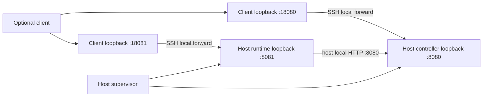

# Local and SSH attachment to an autonomous core

This is the topology companion to [ADR-0012](agent-runtime-deep-dive.md) for
[#12](https://github.com/urucoder/local-studio/issues/12), under #10/#3.
It reconciles the similarly named analysis in
[PR #8](https://github.com/urucoder/local-studio/pull/8).
It is not an implemented deployment guide or evidence of mobile support.

## Confirmed attachment contract

| Concern                             | Local attachment                                  | Remote attachment                                             |
| ----------------------------------- | ------------------------------------------------- | ------------------------------------------------------------- |
| Runtime/controller                  | Separate independently supervised services on Mac | Separate independently supervised services on selected host   |
| Lifetime                            | Outlives every frontend window/process            | Outlives every frontend window/process and SSH connection     |
| Workspace/files/Git/tools/terminals | Selected local runtime host                       | Selected remote runtime host                                  |
| Frontend transport                  | Loopback HTTP                                     | HTTP over SSH local forwards by default                       |
| Frontend exit/recovery              | Detach only; never stop/start a substitute core   | Close/recreate client forwards only; never stop remote core   |
| Core-to-controller routing          | Host-local service settings                       | Host-local service settings, never client-forwarded addresses |
| Availability limit                  | Host must remain awake/online                     | Remote host must remain awake/online; client Mac may be off   |

The PR #8 wording “preserve existing local launch behavior,” “preserve local
behavior” on disconnect, and “preserve existing local mode” does **not** preserve
desktop-owned lifecycle. #10 supersedes it for both modes. Existing local user
workflows should remain usable through attachment and explicit migration, not by
letting frontend shutdown kill their services.

No frontend is an in-process plugin prerequisite. Neither a permanent reverse
tunnel nor an always-running Next facade may become a core dependency. Tailscale
is deferred; no tunnel/provider field appears in service command/activity payloads.
No automatic data synchronization, Mac worker, or silent local fallback is included.

## Proposed first remote topology

The initial Linux/systemd and single-owner choices remain **proposals for owner
review**, along with authentication, vault, PTY retention and recovery policy in the
ADR. SSH alone does not implement any of these.

Ports are illustrative, not identity. Both services are co-located and remain
independently supervised. Clients may change their forwarding ports without
changing runtime settings or identities.

| Consumer                                | Illustrative endpoint                              | Configuration owner                      |
| --------------------------------------- | -------------------------------------------------- | ---------------------------------------- |
| Local client → local runtime/controller | `http://127.0.0.1:8081`, `http://127.0.0.1:8080`   | Client attachment profile                |
| Remote client → runtime/controller      | `http://127.0.0.1:18081`, `http://127.0.0.1:18080` | Client attachment profile                |
| Remote runtime → controller             | `http://127.0.0.1:8080`                            | Runtime's authoritative service settings |

Never persist `:18080` as the remote runtime's controller endpoint or return the
runtime's controller credential to the renderer to make forwarding work.
Clients pin the full provisioned core identity and compare both forwarded services.

## Proposed attach sequence and security boundary

1. Provision and start the separate services through the OS supervisor without a
   frontend. Give them distinct state roots, the explicit projects registry path,
   workspace roots, service-owned secrets and required tools.
2. Authenticate SSH with a trusted verified host key; disable agent forwarding and
   restrict destinations/accounts where practical. Bind client forwarding listeners
   only to loopback and reject occupied ports visibly.
3. Use an SSH connection that runs no remote service command and allocates no
   remote PTY (`-N -T`). It transports HTTP; it does not own service processes.
   Keepalives detect connection loss, not application readiness.
4. Authenticate separately to both HTTP services, negotiate a shared protocol,
   verify pinned core/host/service identities, then inspect readiness/capabilities.
   A successful tunnel is not evidence the correct core is ready or authorized.
5. Resolve the selected workspace through the runtime, obtain a consistent activity
   snapshot, and replay events after its cursor. Display the selected host and any
   stale/disconnected state before permitting mutation.
6. On disconnect, stop consuming streams without cancelling service-owned work.
   On reconnect, repeat authentication/identity negotiation, then reconcile receipts
   and activity. Retry only identical unexpired command IDs within retention rules.
   A host-key/identity/version mismatch blocks; never automatically re-enroll.

SSH protects traffic and authenticates SSH peers, not the caller of every forwarded
HTTP request. #14 must supply HTTP authentication, authorization, Host/origin/CSRF
controls, rate/body limits and redacted logs. Other local processes can connect to
loopback ports. Do not expose raw service ports or credentials as a workaround.
OAuth loopback redirects can need different ephemeral ports and provider-specific
redirect registration; the two illustrative forwards do not solve that problem.

## Evidence corrections and remaining work

- Connector/plugin/project/skill routes already proxy over HTTP; retain them and
  audit bypasses, including desktop project IPC and local Next filesystem/Git/shell
  execution. The ADR links current source; this task does not redo migrated routes.
- Existing runtime PTYs already survive stream detach with bounded in-memory
  replay. That is not a promise of crash/reboot survival or a persistent multiplexer.
- Existing prompt launching/scheduling is not the proposed durable command ledger.
  A tunnel does not remove Electron vault dependence or required frontend callbacks.
- The runtime route registry does not verify a KittyLitter gateway. A phone needs
  its own authenticated ingress to the core; the Mac's SSH tunnel cannot provide
  independent phone availability. Mobile protocol/pairing stays separate under #3.
- Real installation, manual SSH verification and managed tunnels belong to #13/#21;
  attachable UI to #20; host operations/headless tools to #16/#11; durable activity
  to #18; authentication/secrets to #14/#19; migration to #17; acceptance to #22.

The target acceptance is identical locally and remotely: supported work continues
with **zero frontends**, and later attachment restores authoritative state without
duplicate submission. Crash, reboot, controller outage, explicit shutdown and host
sleep are separate scenarios with the conservative proposed guarantees in ADR-0012.
No live SSH deployment or frontend rewrite is delivered by these documents.
