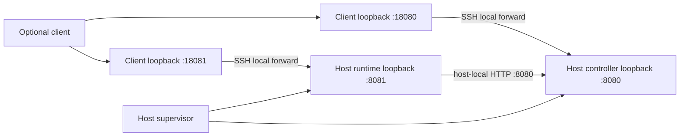

# Local and SSH attachment to Agent Runtime instances

This is the topology companion to [ADR-0012](agent-runtime-deep-dive.md) for
[#12](https://github.com/urucoder/local-studio/issues/12), under #10/#3.
It reconciles the similarly named analysis in
[PR #8](https://github.com/urucoder/local-studio/pull/8).
It is not an implemented deployment guide or evidence of mobile support.

## Confirmed attachment contract

Attachment is orthogonal to lifecycle mode. A client attaches over loopback or SSH
to a **client-owned local** or an **autonomous local/remote** Agent Runtime
instance; the transport never determines or transfers ownership.

| Concern                             | Client-owned instance (local runtime only)                       | Autonomous instance (local or remote runtime)                        |
| ----------------------------------- | ----------------------------------------------------------------- | ---------------------------------------------------------------------- |
| Runtime supervision                 | Started and orderly-stopped by its owning local client             | Independently supervised service                                       |
| Lifetime                            | Survives every detach, window close, and transport loss; ends only at its owner's explicit quit or an authorized stop | Outlives every frontend window/process, SSH connection, and client host |
| Workspace/files/Git/tools/terminals | Owning client's local host                                         | Runtime host, local or remote                                          |
| Controller placement                | Local or remote, resolved by the runtime                           | Local or remote, resolved by the runtime                               |
| Frontend transport                  | Loopback HTTP                                                      | Loopback HTTP locally; HTTP over SSH local forwards remotely           |
| Frontend exit/recovery              | Detach never stops it; only the owner's explicit quit does, and never a substitute instance | Close/recreate client forwards only; never stop the instance           |
| Runtime-to-controller routing       | Runtime-resolved service settings, never client-forwarded addresses | Runtime-resolved service settings, never client-forwarded addresses    |
| Availability limit                  | Owner's host must stay awake/online and the owning application alive | Runtime host must stay awake/online; client host may be off            |

Both kinds of instance may coexist on one host, each with its own identity and data
root. Opening a workspace selects an instance; sessions then follow that instance's
lifecycle, and attaching to a session of another instance never changes its mode.

The PR #8 wording “preserve existing local launch behavior,” “preserve local
behavior” on disconnect, and “preserve existing local mode” conflated attachment
with ownership: today's Electron-launched runtime is the **client-owned local**
mode, and transport loss still must not stop it. Existing local user workflows
remain usable in that mode; moving one to an autonomous instance is an explicit
migration, not an implicit upgrade.

No frontend is an in-process plugin prerequisite. Neither a permanent reverse
tunnel nor an always-running Next facade may become a core dependency. Tailscale
is deferred; no tunnel/provider field appears in service command/activity payloads.
No automatic data synchronization, Mac worker, or silent local fallback is included.

## Proposed first remote topology

The initial Linux/systemd and single-owner choices remain **proposals for owner
review**, along with authentication, vault, PTY retention and recovery policy in the
ADR. SSH alone does not implement any of these. The diagram shows an autonomous
remote instance whose controller happens to be co-located; a controller on a third
host is equally valid, and a client-owned instance keeps its runtime on the client's
own host while its controller may be local or remote.

Ports are illustrative, not identity. Co-location is one deployment shape, not a
requirement: runtime and controller may sit on different hosts in either lifecycle
mode. With instances coexisting on one host, a listening port proves even less about
which instance answers, so clients must verify the pinned identity and the
advertised lifecycle mode. Clients may change their forwarding ports without
changing runtime settings or identities.

| Consumer                                | Illustrative endpoint                              | Configuration owner                      |
| --------------------------------------- | -------------------------------------------------- | ---------------------------------------- |
| Local client → local runtime/controller | `http://127.0.0.1:8081`, `http://127.0.0.1:8080`   | Client attachment profile                |
| Remote client → runtime/controller      | `http://127.0.0.1:18081`, `http://127.0.0.1:18080` | Client attachment profile                |
| Runtime → controller (local or remote)  | `http://127.0.0.1:8080` or a host-resolved remote endpoint | Runtime's authoritative service settings |

Never persist `:18080` as the runtime's controller endpoint or return the runtime's
controller credential to the renderer to make forwarding work. Clients pin the full
provisioned identity — including both the runtime and controller host identities —
and compare both services, so a remote controller cannot be silently replaced by a
local one.

## Proposed attach sequence and security boundary

1. Start the target instance. An autonomous instance is provisioned and supervised
   without a frontend; a client-owned instance is started by its owning local client.
   Either way give each instance distinct state roots, the explicit projects registry
   path, workspace roots, service-owned secrets and required tools — never a data
   root already owned by another instance.
2. For remote attachment, authenticate SSH with a trusted verified host key; disable
   agent forwarding and restrict destinations/accounts where practical. Bind client
   forwarding listeners only to loopback and reject occupied ports visibly. Remote
   attachment reaches autonomous instances only; a client-owned runtime is local to
   its owner.
3. Use an SSH connection that runs no remote service command and allocates no
   remote PTY (`-N -T`). It transports HTTP; it does not own service processes.
   Keepalives detect connection loss, not application readiness.
4. Authenticate separately to both HTTP services, negotiate a shared protocol,
   verify the pinned instance/runtime-host/controller-host/service identities, then
   inspect readiness, lifecycle mode and capabilities. A successful tunnel is not
   evidence that the correct instance is ready, authorized, or in the expected
   lifecycle mode; a changed mode or owner blocks rather than silently re-pins.
5. Resolve the selected workspace through the runtime, obtain a consistent activity
   snapshot, and replay events after its cursor. Display the runtime host, the
   lifecycle mode, and any stale/disconnected state before permitting mutation.
6. On disconnect, stop consuming streams without cancelling service-owned work or
   implying a shutdown in either mode. On reconnect, repeat authentication/identity
   negotiation, then reconcile receipts and activity. Retry only identical unexpired
   command IDs within retention rules, and only against the same instance.
   A host-key/identity/version/lifecycle mismatch blocks; never automatically
   re-enroll or fall back to another instance.

SSH protects traffic and authenticates SSH peers, not the caller of every forwarded
HTTP request. #14 must supply HTTP authentication, authorization, Host/origin/CSRF
controls, rate/body limits and redacted logs. Other local processes can connect to
loopback ports. Do not expose raw service ports or credentials as a workaround.
OAuth loopback redirects can need different ephemeral ports and provider-specific
redirect registration; the two illustrative forwards do not solve that problem.

## Evidence corrections and remaining work

- Connector/plugin/project/skill routes already proxy over HTTP; retain them and
  audit bypasses, including desktop project IPC and local Next filesystem/Git/shell
  execution. The ADR links current source; this task does not redo migrated routes.
- Existing runtime PTYs already survive stream detach with bounded in-memory
  replay. That is not a promise of crash/reboot survival or a persistent multiplexer.
- Existing prompt launching/scheduling is not the proposed durable command ledger.
  A tunnel does not remove Electron vault dependence or required frontend callbacks.
- The runtime route registry does not verify a KittyLitter gateway. A phone needs
  its own authenticated ingress to an instance; a client host's SSH tunnel cannot
  provide independent phone availability, and a client-owned instance cannot provide
  it at all once its owner quits. Mobile protocol/pairing stays separate under #3.
- Coexisting instances are not isolated from each other by SSH, ports, or these
  contracts. Separate data roots plus an explicit workspace isolation policy
  (separate worktrees or exclusive write ownership) remain required; none of it is
  implemented here.
- Real installation, manual SSH verification and managed tunnels belong to #13/#21;
  attachable UI to #20; host operations/headless tools to #16/#11; durable activity
  to #18; authentication/secrets to #14/#19; migration to #17; acceptance to #22.

Target acceptance differs by lifecycle mode. Autonomous instances must continue
supported work with **zero frontends**, locally or remotely. Client-owned instances
must survive every detach, window close and transport loss, and must stop only
through their owner's explicit, orderly quit. In both modes later attachment
restores authoritative state without duplicate submission. Crash, reboot, controller
outage — local or remote — explicit shutdown and host sleep are separate scenarios
with the conservative proposed guarantees in ADR-0012. No live SSH deployment or
frontend rewrite is delivered by these documents.
