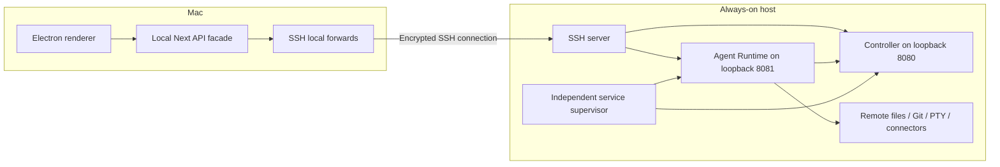

# Local and remote modes over SSH

## Status and relationship to the deep-dive

Documentation-only proposal for PR #8, following the discussion of issue #7 under
#3. Read alongside [the Agent Runtime deep-dive](agent-runtime-deep-dive.md).
This supplement refines its section 6 recommendation: use SSH forwarding as the
first **desktop transport** to independently supervised, co-located services.
It does not implement remote mode or resolve the external mobile protocol.

The first remote profile proposed here uses remote workspaces. Whether a later
profile must allow remote agents to operate on Mac-local files remains an owner
decision; it is not an accepted requirement for this first slice.

## Proposed two-mode contract

| Concern | Local mode | Remote mode |
| --- | --- | --- |
| Electron UI and embedded Next server | Mac | Mac |
| Agent Runtime and controller | Mac | Always-on host |
| Project files, Git, agent tools, terminal processes | Mac | Remote host |
| Sessions, connectors, schedules, runtime settings | Local runtime owns them | Remote runtime owns them |
| Client transport | Loopback HTTP | HTTP over SSH local forwarding |
| Runtime lifecycle | Preserve existing local launch behavior | Independent service supervisor |
| Desktop disconnect | Preserve local behavior | Close client tunnel only; never stop remote services |

Use the same workspace/service contracts in both modes, selected by an explicit
connection profile. Maintain one authoritative owner **per runtime/workspace**;
do not automatically synchronize local and remote sessions, repositories, or secrets.
Show the selected host prominently before opening terminals or running commands.

The analogy is VS Code Remote SSH's local UI and remote workspace execution,
not an SSH shell that somehow makes local files available remotely. See
[VS Code Remote SSH documentation](https://code.visualstudio.com/docs/remote/ssh).

## Topology and lifecycle



The second forward supports the existing frontend-to-controller API path. It is
not a new model transport: runtime-to-controller traffic stays on the remote host.
The remote supervisor, not an SSH login shell or Electron child manager, owns both
services. For systemd user units, provision startup and persistence across logout
and reboot explicitly; an existing unit template alone is not an installation plan.

Closing the Mac must not stop either service. Whether an active turn, event stream,
or PTY survives disconnection is a separate contract to implement and test. Do not
promise reattachment merely because the process remains alive. Never retry a turn
submission automatically without deduplication or an explicit user decision.

## Illustrative manual tunnel setup

**Prerequisites:** separately installed, running services on the remote host; SSH
access; verified host key; runtime authentication and workspace authorization; and
the application changes below. These commands illustrate transport only. They do
not make today's packaged Electron application remote-capable.

1. Provision separate runtime/controller state directories and least-privilege
   service identities. Stage required runtime resources, native modules, shells,
   connector executables, and remote workspace checkouts on that host.
2. Configure the runtime's controller URL as `http://127.0.0.1:8080`, with the
   controller credential. Reconcile persisted settings and controller lists;
   environment changes alone may not override saved configuration.
3. Verify the SSH host fingerprint using a trusted channel and enroll it in
   `known_hosts`. Replace the example hostname/user/key below.
4. On the Mac, add an explicit profile to `~/.ssh/config`:

```sshconfig
Host local-studio-remote
    HostName studio.example.com
    User studio-client
    IdentityFile ~/.ssh/id_ed25519
    IdentitiesOnly yes
    StrictHostKeyChecking yes
    ForwardAgent no
    ExitOnForwardFailure yes
    ServerAliveInterval 30
    ServerAliveCountMax 3
    LocalForward 127.0.0.1:18081 127.0.0.1:8081
    LocalForward 127.0.0.1:18080 127.0.0.1:8080
```

5. Start the tunnel in the foreground:

```sh
ssh -N -T local-studio-remote
```

The `18081` and `18080` ports are illustrative Mac-side ports chosen to avoid the
usual local service ports; select free ports or fail visibly on collision. The
forward destinations are resolved from the SSH server host. This example assumes
both services share that host's network namespace; separate containers require a
different destination/bind design.

Proposed application connection profile:

| Consumer | Endpoint |
| --- | --- |
| Mac Next server → Agent Runtime | `http://127.0.0.1:18081` |
| Mac Next server → controller | `http://127.0.0.1:18080` |
| Remote runtime → controller | `http://127.0.0.1:8080` |

Do not save the Mac's forwarded controller address as the runtime's backend URL.
Connection-profile transport endpoints and authoritative remote controller settings
must be distinct. Bind forwarding listeners to loopback, not `0.0.0.0`.

OpenSSH's `-N` runs no remote command and `-T` disables PTY allocation for the
transport connection. Keepalive settings detect unresponsive connections;
`ExitOnForwardFailure` detects forwarding setup failures, not availability of the
ultimate HTTP services. Check service health and authenticated API access separately.
See the upstream [ssh manual](https://man.openbsd.org/ssh.1) and
[ssh_config manual](https://man.openbsd.org/ssh_config.5).

A later managed desktop connector should expose host-key failures, credential
prompts, occupied ports, tunnel loss, and reconnect status without leaking secrets.
It must not silently launch a local runtime when a remote connection fails.

## Required application work: a tunnel is not decoupling

The following current-code findings are documented with source citations in the
[deep-dive](agent-runtime-deep-dive.md), especially sections 1, 2, 4, and 5:

- **Lifecycle selection:** Electron selects a local runtime handle and overwrites
  Next's runtime URL. Add an explicit externally managed profile that never forks,
  kills, or restarts the remote service during frontend recovery or app shutdown.
- **Filesystem, Git, and terminal execution:** Next still executes local filesystem,
  Git, shell, directory, and comment operations. Move remote-workspace operations
  behind runtime APIs, including path authorization and realpath checks. Existing
  PTY/PR proxies also have frontend-local cwd guards that need host-correct handling.
- **Project selection:** desktop project IPC currently wins over runtime HTTP. In
  remote mode use a remote directory browser/project registry, not a Mac file dialog
  whose absolute path is passed to the remote runtime.
- **Settings and controller resolution:** remove stateful local store bypasses or
  deliberately separate client-only configuration. Do not copy controller secrets
  into renderer state merely to bridge the topology.
- **Runtime callbacks:** required connector/CUA/subagent/automation callbacks must
  not depend on the Mac's Next server. Move service-owned operations into the runtime
  or an independently hosted service. A permanent reverse tunnel to the Mac would
  reintroduce the availability dependency.
- **Secrets and resources:** replace Electron-parent OAuth vault dependence with a
  headless secret backend, and stage plugins/resources independently of Electron.
- **Optional Mac capabilities:** native reveal/open, Mac Chrome tabs, Obsidian, and
  local-agent configuration need explicit capability labels or unsupported states,
  not silent execution on the wrong host.

Remote mode means the agent, Git, file editor API, and terminal share a remote
workspace. A remote agent editing Mac-local files would require a separate,
authenticated Mac worker or a deliberately designed sharing/synchronization layer.
Defer that hybrid profile; it cannot provide Mac-local resources while the Mac is off.

## Security, OAuth, and mobile boundaries

SSH provides private encrypted transport and host/user authentication, not the
application's authorization model. Require runtime credentials distinct from
controller credentials, server-side workspace scope checks, safe Host/origin policy,
and redacted logging. A forwarded loopback port is not proof of a particular app
user. Restrict the SSH account/key to intended forwarding destinations where
practical, keep agent forwarding disabled, and preserve host-key verification.

Headless secret storage is still required. OAuth loopback callbacks need a separate
strategy: provider-supported device flows, an approved callback broker, or carefully
managed temporary callback forwards. The two fixed forwards above do not cover
arbitrary ephemeral OAuth callback ports. Preserve state/PKCE validation and exact
redirect semantics; do not promise that every provider supports the same solution.

The phone must have its **own** authenticated path to the always-on host, not use the
Mac's tunnel. Gateway/relay protocol discovery and mobile pairing remain separate
workstreams. The deep-dive explicitly finds no verified KittyLitter gateway in the
runtime route registry. SSH for desktop access does not complete parent issue #3.

## Phased scope and acceptance

1. Agree on remote-workspace semantics, service identities, capability exclusions,
   and disconnect/reattach behavior. Keep hybrid Mac workers out of the first slice.
2. Make headless services independently installable and supervised, with separate
   durable state, resources, authentication, health/readiness, and safe shutdown.
3. Implement explicit local/remote connection profiles and manual SSH transport;
   preserve existing local mode and prevent fallback to a local service on failure.
4. Close workspace/settings bypasses and frontend callbacks; resolve secrets/OAuth
   for supported capabilities. Add host-aware connection UX and compatibility tests.
5. Add managed SSH lifecycle/reconnect UX after the manual path is validated.
   Continue mobile gateway/pairing independently against its authoritative protocol.

Acceptance checklist for the desktop remote slice:

- [ ] Both modes use the same workspace contracts and visibly identify their host.
- [ ] Open a remote checkout, edit/search a file, run Git and terminal commands,
      and execute an agent turn against the same remote workspace.
- [ ] No remote workspace operation validates or mutates a coincidentally matching
      Mac path; project selection bypasses local desktop IPC in remote mode.
- [ ] Close Electron and power off/disconnect the Mac; independently verify remote
      service and scheduled-work availability without a Mac callback dependency.
- [ ] Reconnect to saved sessions; test documented turn/PTy continuity and expiry
      semantics without duplicate turn execution. Service restart is tested separately.
- [ ] Occupied ports, wrong host keys, invalid credentials, remote outages, and lost
      tunnels produce clear failures; no local fallback or remote service termination.
- [ ] Raw service ports remain private; unauthorized local/forwarded requests fail.
- [ ] Supported OAuth flows work with headless secrets; unsupported capabilities
      are explicit rather than silently broken.
- [ ] Local-only Mac behavior remains covered by regression tests.

## Decisions still required

- Confirm remote checkout ownership versus any future Mac-worker requirement.
- Choose the first host OS/service installation and headless secret backend.
- Define active-turn/PTY persistence, reconnection, retention, and recovery guarantees.
- Select supported OAuth providers/callback strategies and host-local capabilities.
- Decide whether initial manual SSH setup is sufficient before managed connection UX.
- Locate the independent mobile gateway protocol and choose its ingress separately.

## Validation status

This document is a design and illustrative setup guide, not a tested deployment.
No production behavior, service installation, or SSH connection was changed or
validated by adding it. Implementation and end-to-end acceptance remain future work.
